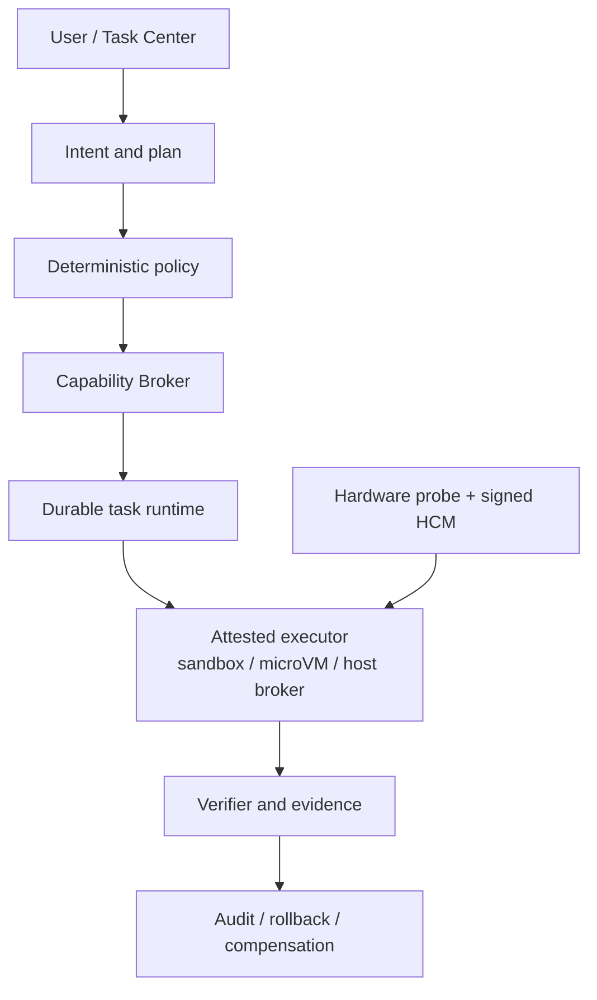

# Andromeda

[](https://github.com/oratis/Andromeda/actions/workflows/ci.yml)
[](./LICENSE)
[](#当前状态)

Andromeda 是一个面向 PC 与 Mac 硬件的 AI 原生桌面操作系统项目。它希望保留 Windows 的游戏、Office 和文件兼容能力，吸收 macOS 的可靠性与软硬件体验，同时把 Codex/Claude Code 式的任务执行、权限、验证和恢复能力变成 OS 的基础设施。

## 当前状态

项目已经进入首个**可安装 Daily Driver Candidate（虚拟硬件）**：

- 有基于 Fedora bootc 44 与 KDE Plasma 的 x86-64 UEFI 离线安装 ISO；
- 有从 ISO 安装到空白磁盘、移除 ISO 后首次启动的 QEMU/OVMF 自动验收；
- 有 bootc 更新到 revision 2、重启验证、回滚到 revision 1 的生命周期验收；
- 有 Flatpak/Discover、LibreOffice、Firefox、中文输入、音视频、打印/扫描、
  固件、游戏运行基础和常见文件格式支持；
- 有真实 Plasma Wayland、PipeWire、Office 格式、浏览器启动、安全暴露面和
  用户数据跨更新/回滚持久性的自动验收；
- 有可编译、可测试的 Rust workspace；
- 有模型不可绕过的任务、风险、能力、隔离和状态机契约；
- 有持久化任务服务、HTTP API 与开发者 CLI；
- 有 Linux、macOS、Windows 硬件探测和 Hardware Compatibility Manifest（HCM）匹配；
- 有启动时驱动诊断、HCM v2 artifact/evidence 门禁，以及 NVMe/SATA/IDE、
  e1000e/e1000、XHCI/UHCI、HDA/AC97 的虚拟硬件矩阵；
- 有跨平台 CI、产品计划和专题研究。

这个里程碑证明 Andromeda 能构建、安装、进入真实桌面、运行一组日用工作流和 AI
任务控制面，并完成更新与回滚；它**仍不是已完成认证的消费操作系统**。目前只有
QEMU/KVM x86-64 + OVMF 达到自动验收门槛，没有宣称任何消费级 PC 或 Mac 已达到
Supported 或 Certified。

2026-07-28 的[可安装 OS 验收 #30341131852](https://github.com/oratis/Andromeda/actions/runs/30341131852)
已经在全新 32 GiB 虚拟磁盘上完整通过（该记录使用 32 GiB 盘；现行
`os/scripts/test-install.sh` 已改为 64 GiB，证据快照早于此调整）。受测 ISO 的 SHA-256 为
`c04d8f6de780f978e261e1867283894abf2a7996b6105525660c52343ae45073`；
运行证据、产物标识和逐项验收结果见
[Developer Preview 安装指南](./docs/development/installable-preview.md#已验证构建)。

2026-07-28 的 GCP 嵌套 KVM 日用版运行又在全新 32 GiB 虚拟磁盘上完成离线安装、
Plasma Wayland 首启、revision 2 更新和 revision 1 回滚（同样是 32 GiB 记录盘，
现行 harness 已改为 64 GiB）。受测 3.8 GiB ISO 的
SHA-256 为
`6f8d74e5f14b7dab9c478b8fd538defbdbde717dee62bbc3c7ca5c13cc597108`。
注意：该 PASS 记录早于证据提取器修复，修复只在原始串口日志上离线复验过；
用最终版脚本一次性跑绿的完整 GCP 复跑仍在待办中。消费能力、完整标记和证据
边界见
[Daily Driver Candidate E2E](./docs/development/daily-driver-e2e.md#已验证运行)。

## 第一性目标

1. 继续运行用户已有的游戏、Office 工作流与重要文件。
2. 更新、驱动和应用失败时保持可启动、可解释、可恢复。
3. AI 能替用户完成任务，但模型本身不拥有系统权限。
4. 对广泛硬件进行探测，对通过真实测试的硬件才作支持承诺。
5. Windows/macOS 迁移是有 manifest、校验和回退的产品流程。

## 已实现的代码

| 组件 | 作用 |
|---|---|
| `andromeda-core` | Intent、ActionPlan、L0–L3 风险、Capability、Evidence、恢复语义、任务状态机 |
| `andromeda-policy` | deny-first 确定性授权、能力范围、过期、隔离等级与外部副作用确认 |
| `andromeda-runtime` | 原子 JSON 持久化、跨进程锁、DAG 校验、事件历史、乐观并发 |
| `andromeda-taskd` | 默认仅监听 loopback 的任务 HTTP 控制面 |
| `andromeda-cli` | 任务创建/查看/策略评估/状态转换和硬件探测 |
| `andromeda-hardware` | Linux/macOS/Windows 隐私友好探测与 HCM 评估 |



当前安装镜像运行控制面、策略评估和硬件预检；图中的真实 executor、凭据代理和
完整 OS 事务后端仍是后续安全里程碑。任务 API 不会执行模型提出的动作。

## 快速开始

需要 Rust 1.85 或更新版本。

```bash
cargo test --workspace --locked
cargo clippy --workspace --all-targets --locked -- -D warnings
```

探测当前电脑（报告不收集序列号）：

```bash
cargo run --locked --bin andromeda -- hardware probe
cargo run --locked --bin andromeda -- hardware diagnose
```

对示例 HCM 做本机匹配：

```bash
cargo run --locked --bin andromeda -- hardware check \
  examples/hcm/developer-x86_64-pc.json
```

创建一个显式授予只读目录范围的检查任务：

```bash
cargo run --locked --bin andromeda -- \
  --state-dir .andromeda/state \
  task create-inspection . --requested-by local-user
```

启动本地任务服务：

```bash
cargo run --locked --bin andromeda-taskd
curl http://127.0.0.1:7777/healthz
```

构建 ISO、安装安全边界和完整生命周期验收见
[Developer Preview 安装指南](./docs/development/installable-preview.md)和
[Daily Driver Candidate E2E](./docs/development/daily-driver-e2e.md)。控制面开发步骤见
[开发者入门](./docs/development/getting-started.md)和
[任务控制面说明](./docs/development/task-control-plane.md)。

## 安全边界

- 模型输出始终是不可信输入；
- 权限由宿主 Capability Broker/Policy 决定，不由自然语言决定；
- L2 未知内容需要 microVM，L3 外部副作用需要 host broker 和最终确认；
- deny 规则优先于 capability；
- 计划状态不能跳过验证直接成功；
- 当前 `taskd` 是非特权开发服务，默认只监听 `127.0.0.1`；
- CLI 的 `--isolation` 只用于策略模拟，不是沙箱证明；
- 当前没有真实 tool executor，不应把 API 暴露到不可信网络。

安全问题请阅读 [SECURITY.md](./SECURITY.md)。

## 硬件与兼容战略

| 类别 | 当前产品状态 |
|---|---|
| QEMU/KVM x86-64 + OVMF | Daily Driver Candidate；安装/桌面/更新/回滚自动验收 |
| QEMU NVMe/SATA/IDE + e1000e/e1000 | Phase 1 pairwise driver matrix |
| 选定 x86-64 PC | 下一阶段 Developer Preview 候选 |
| 未认证通用 PC | Community，探测不等于支持 |
| 非 T2 Intel Mac | 逐机型 Pilot |
| T2 Intel Mac | Experimental |
| M1/M2 Mac | 独立 Asahi Preview 候选 |
| M3 及更新 Apple silicon（含 M5） | Watch；必须等待对应 Asahi 机型页与安装器，不作交付承诺 |

详细规则见[硬件、驱动与迁移研究](./docs/research/hardware-drivers-and-migration.md)、
[硬件普适性工程](./docs/development/hardware-enablement.md)和
[HCM 开发说明](./docs/development/hardware-compatibility.md)。

## 路线

近期工程顺序：

1. 签名 HCM、安装前预检和 QEMU/真实 PC CI；
2. bootc/OCI + OSTree 镜像、断电安全更新与恢复环境；
3. Plasma/KWin Task Center adapter 与 Capability Broker daemon；
4. 受证明的 bubblewrap/SELinux sandbox 和 microVM executor；
5. Steam/Proton 管理域、Windows Workspace、Office/格式路由；
6. Windows/macOS 迁移扫描器；
7. M1/M2 Asahi 独立 Preview。

完整阶段、SLO 和前 12 周计划见[产品开发计划](./docs/product-development-plan.md)。

## 文档

- [文档总览](./docs/README.md)
- [Developer Preview 安装与验收](./docs/development/installable-preview.md)
- [Daily Driver Candidate 与 GCP E2E](./docs/development/daily-driver-e2e.md)
- [硬件普适性工程与自动矩阵](./docs/development/hardware-enablement.md)
- [PC/macOS 操作系统全景](./docs/os-landscape-and-andromeda-architecture.md)
- [开源组件采用矩阵](./docs/research/open-source-adoption-matrix.md)
- [Windows 游戏、Office 与文件格式](./docs/research/windows-gaming-office-formats.md)
- [可靠更新、隔离与 AI Agent](./docs/research/reliability-update-ai-agent.md)
- [桌面平台与发行工程](./docs/research/desktop-platform-and-distribution.md)

## 参与开发

请先阅读 [CONTRIBUTING.md](./CONTRIBUTING.md)。项目正在建立 ADR 实践：关键系统设计将通过 ADR（模板与流程见 [docs/adr/](./docs/adr/)）和小型、可验证的 PR 推进；任何进入特权边界的实现都必须同时提供威胁模型、故障路径和测试证据。

使用 Codex 进行调研、开发、安装 E2E、故障诊断和发布时，可调用仓库内的
[`$andromeda-os-engineering` skill](./skills/andromeda-os-engineering/SKILL.md)。它包含项目边界、
测试与合并门槛、GCP 生命周期规则和已知故障防线，并提供只读仓库/PR 审计脚本。

项目使用 [Apache License 2.0](./LICENSE)。

---

**English summary:** Andromeda is an early AI-native desktop OS project targeting broad
PC hardware and selected Mac cohorts. The repository now builds an installable x86-64
UEFI Daily Driver Candidate and verifies offline installation, a real Plasma Wayland
session, common consumer workflows, bootc update, and rollback under QEMU/OVMF. It is not
yet a certified consumer OS, and no physical PC or Mac model is certified.
