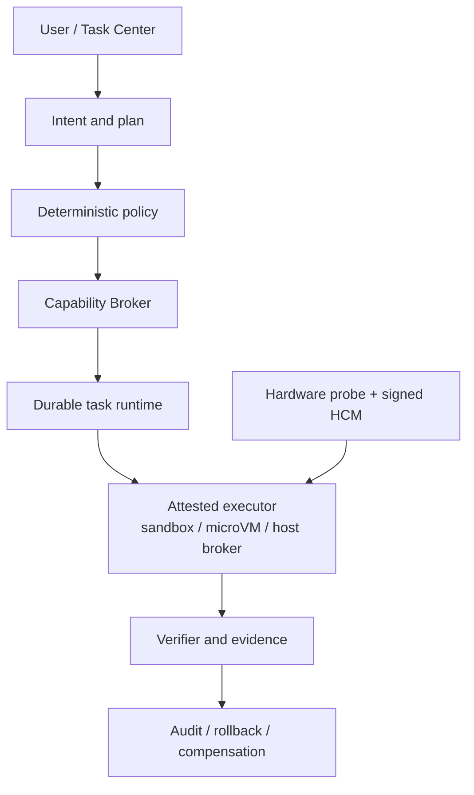

# Andromeda

[](https://github.com/oratis/Andromeda/actions/workflows/ci.yml)
[](./LICENSE)
[](#当前状态)

Andromeda 是一个面向 PC 与 Mac 硬件的 AI 原生桌面操作系统项目。它希望保留 Windows 的游戏、Office 和文件兼容能力，吸收 macOS 的可靠性与软硬件体验，同时把 Codex/Claude Code 式的任务执行、权限、验证和恢复能力变成 OS 的基础设施。

## 当前状态

项目已经从纯调研进入 **v0 工程原型**：

- 有可编译、可测试的 Rust workspace；
- 有模型不可绕过的任务、风险、能力、隔离和状态机契约；
- 有持久化任务服务、HTTP API 与开发者 CLI；
- 有 Linux、macOS、Windows 硬件探测和 Hardware Compatibility Manifest（HCM）匹配；
- 有跨平台 CI、产品计划和专题研究。

Andromeda **现在还不是可安装或可日常使用的完整操作系统**，也没有宣称任意 PC/Mac 已达到 Supported 或 Certified。当前代码是后续安装器、不可变系统镜像、Task Center、兼容环境和硬件认证的安全控制面基线。

## 第一性目标

1. 继续运行用户已有的游戏、Office 工作流与重要文件。
2. 更新、驱动和应用失败时保持可启动、可解释、可恢复。
3. AI 能替用户完成任务，但模型本身不拥有系统权限。
4. 对广泛硬件进行探测，对通过真实测试的硬件才作支持承诺。
5. Windows/macOS 迁移是有 manifest、校验和回退的产品流程。

## 已实现的代码

| 组件 | 作用 |
|---|---|
| `andromeda-core` | Intent、ActionPlan、L0–L3 风险、Capability、Evidence、恢复语义、任务状态机 |
| `andromeda-policy` | deny-first 确定性授权、能力范围、过期、隔离等级与外部副作用确认 |
| `andromeda-runtime` | 原子 JSON 持久化、跨进程锁、DAG 校验、事件历史、乐观并发 |
| `andromeda-taskd` | 默认仅监听 loopback 的任务 HTTP 控制面 |
| `andromeda-cli` | 任务创建/查看/策略评估/状态转换和硬件探测 |
| `andromeda-hardware` | Linux/macOS/Windows 隐私友好探测与 HCM 评估 |



当前仓库只实现到控制面、策略评估和硬件预检；图中的真实 executor、凭据代理和 OS 事务后端仍是后续安全里程碑。任务 API 不会执行模型提出的动作。

## 快速开始

需要 Rust 1.85 或更新版本。

```bash
cargo test --workspace
cargo clippy --workspace --all-targets -- -D warnings
```

探测当前电脑（报告不收集序列号）：

```bash
cargo run --bin andromeda -- hardware probe
```

对示例 HCM 做本机匹配：

```bash
cargo run --bin andromeda -- hardware check \
  examples/hcm/developer-x86_64-pc.json
```

创建一个显式授予只读目录范围的检查任务：

```bash
cargo run --bin andromeda -- \
  --state-dir .andromeda/state \
  task create-inspection . --requested-by local-user
```

启动本地任务服务：

```bash
cargo run --bin andromeda-taskd
curl http://127.0.0.1:7777/healthz
```

更完整的步骤见[开发者入门](./docs/development/getting-started.md)和[任务控制面说明](./docs/development/task-control-plane.md)。

## 安全边界

- 模型输出始终是不可信输入；
- 权限由宿主 Capability Broker/Policy 决定，不由自然语言决定；
- L2 未知内容需要 microVM，L3 外部副作用需要 host broker 和最终确认；
- deny 规则优先于 capability；
- 计划状态不能跳过验证直接成功；
- 当前 `taskd` 是非特权开发服务，默认只监听 `127.0.0.1`；
- CLI 的 `--isolation` 只用于策略模拟，不是沙箱证明；
- 当前没有真实 tool executor，不应把 API 暴露到不可信网络。

安全问题请阅读 [SECURITY.md](./SECURITY.md)。

## 硬件与兼容战略

| 类别 | 当前产品状态 |
|---|---|
| QEMU/KVM x86-64 | CI/架构基线 |
| 选定 x86-64 PC | 下一阶段 Developer Preview 候选 |
| 未认证通用 PC | Community，探测不等于支持 |
| 非 T2 Intel Mac | 逐机型 Pilot |
| T2 Intel Mac | Experimental |
| M1/M2 Mac | 独立 Asahi Preview 候选 |
| M3 及更新 Apple silicon（含 M5） | Watch；必须等待对应 Asahi 机型页与安装器，不作交付承诺 |

详细规则见[硬件、驱动与迁移研究](./docs/research/hardware-drivers-and-migration.md)和[HCM 开发说明](./docs/development/hardware-compatibility.md)。

## 路线

近期工程顺序：

1. 签名 HCM、安装前预检和 QEMU/真实 PC CI；
2. bootc/OCI + OSTree 镜像、断电安全更新与恢复环境；
3. Plasma/KWin Task Center adapter 与 Capability Broker daemon；
4. 受证明的 bubblewrap/SELinux sandbox 和 microVM executor；
5. Steam/Proton 管理域、Windows Workspace、Office/格式路由；
6. Windows/macOS 迁移扫描器；
7. M1/M2 Asahi 独立 Preview。

完整阶段、SLO 和前 12 周计划见[产品开发计划](./docs/product-development-plan.md)。

## 文档

- [文档总览](./docs/README.md)
- [PC/macOS 操作系统全景](./docs/os-landscape-and-andromeda-architecture.md)
- [开源组件采用矩阵](./docs/research/open-source-adoption-matrix.md)
- [Windows 游戏、Office 与文件格式](./docs/research/windows-gaming-office-formats.md)
- [可靠更新、隔离与 AI Agent](./docs/research/reliability-update-ai-agent.md)
- [桌面平台与发行工程](./docs/research/desktop-platform-and-distribution.md)

## 参与开发

请先阅读 [CONTRIBUTING.md](./CONTRIBUTING.md)。关键系统设计通过 ADR 和小型、可验证的 PR 推进；任何进入特权边界的实现都必须同时提供威胁模型、故障路径和测试证据。

项目使用 [Apache License 2.0](./LICENSE)。

---

**English summary:** Andromeda is an early AI-native desktop OS project targeting broad PC hardware and selected Mac cohorts. The repository currently contains a safe task-control-plane prototype, cross-platform hardware/HCM tooling, research, and a staged product plan—not a bootable consumer OS yet.
