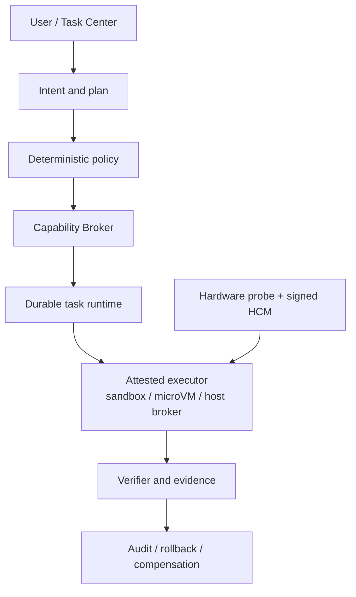
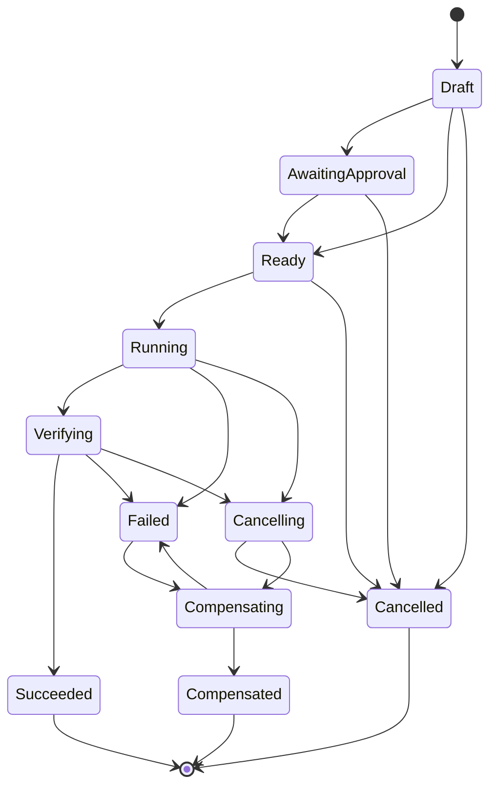

# Andromeda

[](https://github.com/oratis/Andromeda/actions/workflows/ci.yml)
[](https://github.com/oratis/Andromeda/actions/workflows/os-e2e.yml)
[](./LICENSE)
[](./rust-toolchain.toml)
[](#current-status)

**English** · [简体中文](./README.zh-CN.md)

**Andromeda is an AI-native desktop operating system project for PC and Mac hardware.**

It aims to keep the gaming, Office, and file compatibility people rely on from Windows, adopt
the reliability and hardware/software experience of macOS, and turn Codex/Claude Code-style
task execution, authorization, verification, and recovery into OS infrastructure — rather than
bolting yet another chat box onto a desktop.

The central claim is a single sentence: **an AI may complete tasks for the user, but the model
itself never holds system authority.** Models propose plans; deterministic code owns
authorization, state transitions, execution, verification, and persistence.

---

## Contents

- [Current status](#current-status)
- [First-principles goals](#first-principles-goals)
- [Architecture](#architecture)
- [Repository layout](#repository-layout)
- [Quick start](#quick-start)
- [Core model](#core-model)
- [CLI reference](#cli-reference)
- [HTTP API reference](#http-api-reference)
- [Durability and concurrency](#durability-and-concurrency)
- [Building the installable OS image](#building-the-installable-os-image)
- [Hardware compatibility and support tiers](#hardware-compatibility-and-support-tiers)
- [Security boundary](#security-boundary)
- [CI and merge gates](#ci-and-merge-gates)
- [Roadmap](#roadmap)
- [Documentation index](#documentation-index)
- [Contributing](#contributing)
- [License](#license)

---

## Current status

The project has reached its first installable **Daily Driver Candidate (virtual hardware)**:

- an x86-64 UEFI offline installation ISO based on Fedora bootc 44 and KDE Plasma;
- automated QEMU/OVMF acceptance covering installation onto a blank disk from the ISO and
  first boot after the ISO is removed;
- lifecycle acceptance covering a bootc update to revision 2, reboot verification, and
  rollback to revision 1;
- Flatpak/Discover, LibreOffice, Firefox, Chinese input, audio/video, printing/scanning,
  firmware, gaming fundamentals, and common file-format support;
- automated acceptance of a real Plasma Wayland session, PipeWire, Office formats, browser
  launch, the security exposure surface, and user-data persistence across update and rollback;
- a buildable, testable Rust workspace (`unsafe_code = "forbid"` workspace-wide);
- task, risk, capability, isolation, and state-machine contracts the model cannot bypass;
- a durable task service, HTTP API, and developer CLI;
- Linux, macOS, and Windows hardware probing with Hardware Compatibility Manifest (HCM)
  matching;
- boot-time driver diagnosis, HCM v2 artifact/evidence gating, and a virtual hardware matrix
  covering NVMe/SATA/IDE, e1000e/e1000, XHCI/UHCI, and HDA/AC97;
- cross-platform CI, a product plan, and topic research.

This milestone proves Andromeda can build, install, reach a real desktop, run a set of
day-to-day workflows plus the AI task control plane, and complete update and rollback.

> [!IMPORTANT]
> It is **still not a certified consumer operating system**. Only QEMU/KVM x86-64 + OVMF meets
> the automated acceptance bar, and **no consumer PC or Mac is claimed to have reached
> Supported or Certified**.

### Verified evidence

**[Installable OS acceptance #30341131852](https://github.com/oratis/Andromeda/actions/runs/30341131852) (2026-07-28)**
passed end to end on a fresh 32 GiB virtual disk. The tested ISO has SHA-256
`c04d8f6de780f978e261e1867283894abf2a7996b6105525660c52343ae45073`.
That record used a 32 GiB disk; the current `os/scripts/test-install.sh` has since moved to
64 GiB, so the evidence snapshot predates that change.

**GCP nested-KVM daily-driver run (2026-07-28)**
completed offline installation, Plasma Wayland first boot, the revision 2 update, and the
revision 1 rollback, also on a fresh 32 GiB virtual disk. The tested 3.8 GiB ISO has SHA-256
`6f8d74e5f14b7dab9c478b8fd538defbdbde717dee62bbc3c7ca5c13cc597108`.
Note: that PASS predates a fix to the evidence extractor, and the fix has only been re-verified
offline against the original serial logs; **a full GCP re-run that goes green in one pass with
the final scripts is still outstanding.**

Per-item acceptance results and artifact identities are in the
[Developer Preview installation guide](./docs/development/installable-preview.md#已验证构建) and
[Daily Driver Candidate E2E](./docs/development/daily-driver-e2e.md#已验证运行).

---

## First-principles goals

1. Keep running the games, Office workflows, and important files users already have.
2. Stay bootable, explainable, and recoverable when updates, drivers, and applications fail.
3. Let AI complete tasks for the user without the model itself holding system authority.
4. Probe broad hardware, but promise support only for hardware that passes real testing.
5. Make Windows/macOS migration a product flow with manifests, verification, and fallback.

---

## Architecture



The current installation image runs the **control plane, policy evaluation, and hardware
preflight**. The real executor, credential broker, and full OS transaction backend in the
diagram remain later security milestones. **The task API does not execute actions proposed by
a model.**

Implementation boundary of the data flow:

```text
Intent
  -> versioned ActionPlan            ✅ implemented
  -> schema / risk / DAG validation  ✅ implemented
  -> Capability + deterministic policy ✅ implemented
  -> durable TaskRecord              ✅ implemented
  -> attested Executor               ❌ not implemented
  -> independent Verifier            ❌ not implemented
  -> Evidence + audit + recovery     ⚠️ data model exists, executor does not
```

### Implemented components

| Crate | Responsibility |
|---|---|
| [`andromeda-core`](./crates/andromeda-core) | Intent, ActionPlan, L0–L3 risk, Capability, Evidence, recovery semantics, task state machine |
| [`andromeda-policy`](./crates/andromeda-policy) | Deny-first deterministic authorization, capability scope, expiry, isolation levels, external side-effect confirmation |
| [`andromeda-runtime`](./crates/andromeda-runtime) | Atomic JSON persistence, cross-process locking, DAG validation, event history, optimistic concurrency |
| [`andromeda-taskd`](./crates/andromeda-taskd) | Task HTTP control plane, loopback-only by default |
| [`andromeda-cli`](./crates/andromeda-cli) | Task creation/inspection/policy evaluation/state transitions and hardware probing |
| [`andromeda-hardware`](./crates/andromeda-hardware) | Privacy-conscious Linux/macOS/Windows probing and HCM evaluation |

---

## Repository layout

```text
.
├── crates/                    # Rust workspace (6 crates, unsafe forbidden)
│   ├── andromeda-core/        # Task, plan, capability, risk, and state-machine contracts
│   ├── andromeda-policy/      # Deny-first deterministic authorization engine
│   ├── andromeda-runtime/     # Atomic persistence, cross-process locking, TaskService
│   ├── andromeda-taskd/       # Loopback-only HTTP control plane
│   ├── andromeda-cli/         # The `andromeda` developer CLI
│   └── andromeda-hardware/    # Cross-platform probing, driver diagnosis, HCM matching
├── os/                        # Fedora bootc 44 + KDE Plasma installable image
│   ├── Containerfile          # bootc base image definition
│   ├── files/                 # systemd / bootc / libexec files injected into the image
│   ├── installer/             # Kickstart, preflight, platform guard
│   └── scripts/               # build-iso / test-install / hardware matrix / GCP E2E
├── schemas/                   # hardware-compatibility-manifest.schema.json
├── examples/hcm/              # Example Hardware Compatibility Manifest
├── skills/                    # In-repo engineering skill (boundaries, gates, failure defenses)
├── docs/                      # Research, product plan, development guides, ADRs, reviews
└── .github/workflows/         # ci.yml (three platforms) / os-e2e.yml (install acceptance)
```

---

## Quick start

### Prerequisites

- **Rust 1.85 or newer** (`rust-toolchain.toml` pins 1.85.0 with clippy and rustfmt);
- Git;
- Linux, macOS, or Windows (all three are verified in CI).

Building the OS image has additional requirements — see
[Building the installable OS image](#building-the-installable-os-image).

### Verify the workspace

```bash
cargo fmt --all -- --check
```

```bash
cargo test --workspace --locked
```

```bash
cargo clippy --workspace --all-targets --locked -- -D warnings
```

### Probe this machine

The report collects no serial numbers and is never uploaded automatically:

```bash
cargo run --locked --bin andromeda -- hardware probe
```

Real output on an Apple silicon Mac:

```json
{
  "schema_version": 1,
  "collected_at": "2026-08-01T13:33:09.645635Z",
  "os_family": "macos",
  "identity": {
    "manufacturer": "Apple Inc.",
    "model": "Mac16,7",
    "board": null,
    "firmware_version": null
  },
  "cpu": { "architecture": "aarch64", "model": "Apple M4 Pro", "logical_cores": 14 },
  "memory": { "bytes": 25769803776 },
  "boot": { "uefi": false, "secure_boot": null, "tpm2": null, "virtualization": true },
  "devices": [],
  "warnings": [
    "macOS does not expose Apple boot policy as a TPM/Secure Boot equivalent; HCM must verify the platform-specific boot provider.",
    "Detailed Mac device support requires an exact Asahi or Intel/T2 model manifest."
  ]
}
```

Every field under `boot` is tri-state: `null` means **could not be verified** (for example, a
probe running without the privileges the platform requires), which is deliberately a different
conclusion from `false` (verified absent).

Driver binding and support-relevant device readiness:

```bash
cargo run --locked --bin andromeda -- hardware diagnose
```

### Evaluate the example HCM against this host

```bash
cargo run --locked --bin andromeda -- hardware check examples/hcm/developer-x86_64-pc.json
```

Real result from the same Mac against the generic x86-64 PC manifest — **probing successfully
is not the same as being supported**:

```json
{
  "manifest_id": "developer-x86-64-pc",
  "selector_matched": false,
  "requirements_met": false,
  "declared_tier": "community",
  "effective_tier": "blocked",
  "boot_provider": "pc_uefi_shim",
  "evidence": [
    "HCM schema version 2 is current",
    "memory 25769803776 >= required 8589934592",
    "virtualization = true"
  ],
  "missing": [
    "hardware identity did not match any manifest selector",
    "UEFI = false, expected true"
  ]
}
```

`effective_tier` equals the manifest's declared tier only when the selectors **and** the
requirements are all satisfied; otherwise it drops to `blocked` (process exit code `2`).

### Create a task with an explicitly granted scope

```bash
cargo run --locked --bin andromeda -- \
  --state-dir .andromeda/state \
  task create-inspection . --requested-by local-user
```

The command canonicalizes the target directory, mints a read-only file capability, creates one
L1 inspection action, validates the schema, risk floors, dependency DAG, and capability
coverage, then atomically writes the task record. **It does not traverse or modify the
directory** — the current runtime contains no tool executor.

Result (path shortened for readability):

```json
{
  "plan": {
    "schema_version": 1,
    "task_id": "7979a783-3202-4c37-81e0-5504bb5f6049",
    "intent": {
      "summary": "Inspect /home/you/project",
      "requested_by": "local-user",
      "created_at": "2026-08-01T13:32:57.151433Z"
    },
    "actions": [
      {
        "id": "145a9da0-ec21-4004-b6dd-119605168b44",
        "name": "Inspect directory metadata",
        "kind": "inspect",
        "target": "/home/you/project",
        "required_capabilities": ["7b7b0aad-3e5a-485a-84f9-8b368085b430"],
        "risk": "l1_sandboxed",
        "recovery": "none"
      }
    ]
  },
  "state": "ready",
  "revision": 0,
  "capabilities": [
    {
      "id": "7b7b0aad-3e5a-485a-84f9-8b368085b430",
      "resource": { "type": "files", "root": "/home/you/project", "access": "read" },
      "issued_to": "7979a783-3202-4c37-81e0-5504bb5f6049",
      "expires_at": null,
      "single_use": false
    }
  ],
  "events": [{ "actor": "local-user", "kind": { "type": "created" } }]
}
```

### Evaluate policy (executing nothing)

```bash
cargo run --locked --bin andromeda -- \
  --state-dir .andromeda/state \
  task evaluate 7979a783-3202-4c37-81e0-5504bb5f6049
```

```json
{
  "task_id": "7979a783-3202-4c37-81e0-5504bb5f6049",
  "revision": 1,
  "decisions": {
    "145a9da0-ec21-4004-b6dd-119605168b44": {
      "effect": "allow",
      "reasons": ["risk, isolation, capability, and deny-rule checks passed"]
    }
  }
}
```

### Start the local task service

```bash
RUST_LOG=info cargo run --locked --bin andromeda-taskd
```

```bash
curl http://127.0.0.1:7777/healthz
```

It listens on `127.0.0.1:7777` with state directory `.andromeda/state` by default.
**The API currently has no authentication of any kind; it must not be rebound off loopback.**

---

## Core model

### Risk levels and minimum isolation

A model may declare an action **more** dangerous than required, but never **safer** — the
`ActionKind` sets a risk floor that cannot be lowered.

| Level | Meaning | Minimum isolation |
|---|---|---|
| `L0Reasoning` | Reasoning with no tools and no external data | `None` |
| `L1Sandboxed` | Ordinary file/task operations | `Sandbox` |
| `L2StrongIsolation` | Unknown content, parsers, executable input | `MicroVm` |
| `L3ExternalSideEffect` | Network, system settings, real external side effects | `Brokered` + final confirmation |

### Action kinds and risk floors

| `ActionKind` | Minimum risk | Meaning of `target` |
|---|---|---|
| `reason` | L0 | — |
| `inspect` / `read_file` | L1 | Absolute path |
| `write_file` / `create_directory` / `delete_file` | L1 | Absolute path |
| `move_file` | L1 | Source path; destination lives in `arguments.destination`, and **both endpoints need write coverage** |
| `parse_untrusted_content` | L2 | Absolute path |
| `network_request` | L3 | `host` or `host:port` |
| `system_change` | L3 | System setting key |
| `external_call` | L3 | `service:operation`, split at the **first** `:` |

### Capabilities

A capability is a resource-scoped permission that **expires independently and never stores a
secret value**:

| Resource | Coverage |
|---|---|
| `files` | Paths under `root` after lexical normalization, plus `read`/`write`/`read_write` |
| `network` | An **exact** host (case-insensitive, trailing dot ignored); subdomains are never covered; a `null` port covers any port |
| `system_setting` | One named system setting key |
| `external_service` | One operation on one external service |

### Deterministic policy engine

For each action, `PolicyEngine` checks, in order: the risk floor → whether isolation is
satisfied → deny rules → whether capabilities are present, active, cover the target, and are
bound to the subject. **Any failed check yields `deny`**, with every failure reason accumulated
into `reasons` for auditability. Only a missing L3 final confirmation yields `ask`. Everything
passing yields `allow`.

The default `PolicySet` denies `/boot`, `/etc`, `/usr`, `/System`, and `C:\Windows`, and
requires confirmation for external side effects. Paths are lexically normalized before
comparison, so traversal such as `/tmp/../etc/passwd` cannot dodge a denied root; targets that
cannot be normalized (relative paths, `..` past the root) are denied outright.

### Task state machine



Key invariants:

- **`Running` cannot jump straight to `Succeeded`** — it must pass through `Verifying`;
- `Failed` is terminal but keeps one outgoing edge, `Failed → Compensating`, so recovery
  semantics can reopen it;
- two authorization-sensitive edges are re-checked against policy:
  - `AwaitingApproval → Ready` requires a fully granted plan, so a task suspended for missing
    authorization must first receive the missing capabilities;
  - `Ready → Running` re-runs the policy engine at each action's per-action minimum isolation
    and refuses the transition if any action is `deny` or `ask` (a capability that expired
    after `Ready`, for example, is caught here).

> [!WARNING]
> **`Ready` does not mean "authorized to execute".** It only guarantees that policy would allow
> the plan under the most permissive execution assumption. It does not guarantee that isolation
> is sufficient at execution time, that capabilities are still unexpired, that an L3 action has
> human confirmation, or that a capability came from a trusted issuer — the v0 control plane
> does not validate an issuance chain, so a creator can mint its own capabilities.

---

## CLI reference

Global flag: `--state-dir <PATH>` (env `ANDROMEDA_STATE_DIR`, default `.andromeda/state`).

| Command | Purpose |
|---|---|
| `andromeda task create-inspection <PATH> [--requested-by <ACTOR>]` | Create a read-only directory inspection plan and explicitly grant its scope |
| `andromeda task list` | List all durable task records |
| `andromeda task show <TASK_ID>` | Show one task record |
| `andromeda task evaluate <TASK_ID> [--isolation <LEVEL>] [--confirm-external]` | Evaluate policy without executing any action |
| `andromeda task record-outcome <TASK_ID> --action-id <ID> --status <STATUS> --evidence <TEXT> --expected-revision <N>` | Record one action's execution outcome and evidence (repeat `--evidence` for multiple items) |
| `andromeda task transition <TASK_ID> --to <STATE> --expected-revision <N> [--actor <ACTOR>] [--confirm-external]` | Apply a checked state transition with optimistic concurrency |
| `andromeda hardware probe` | Print a privacy-conscious hardware report |
| `andromeda hardware diagnose` | Diagnose driver binding and support-relevant device readiness |
| `andromeda hardware check <MANIFEST> [--require-tier <TIER>] [--artifact-root <DIR>] [--trusted-key <KEY_ID>]` | Probe this host and evaluate one HCM JSON document |

`--isolation` accepts `none`, `sandbox`, `micro-vm`, and `brokered`. When omitted, each action
is evaluated at the minimum isolation implied by **its own declared risk**; when given, it
overrides isolation for **every** action, which is mainly useful for probing a whole plan under
one level.

> [!CAUTION]
> `--isolation` is a policy-input simulation, **not a sandbox proof**. A real executor must
> supply unforgeable isolation evidence through a future attestation interface.

Exit codes for `hardware check`:

| Exit code | Meaning |
|---|---|
| `0` | The effective tier is usable |
| `2` | The effective tier is `blocked` |
| `3` | The effective tier is below the tier given via `--require-tier` |

---

## HTTP API reference

`andromeda-taskd` flags: `--listen` (`ANDROMEDA_LISTEN`, default `127.0.0.1:7777`) and
`--state-dir` (`ANDROMEDA_STATE_DIR`, default `.andromeda/state`).

| Method | Path | Purpose |
|---|---|---|
| `GET` | `/healthz` | Service status and API version |
| `POST` | `/v1/tasks` | Validate and create a task |
| `GET` | `/v1/tasks` | List tasks as `{"tasks": [...], "warnings": [...]}`; a corrupt record file is skipped and reported in `warnings` instead of failing the whole listing |
| `GET` | `/v1/tasks/{id}` | Read one task |
| `POST` | `/v1/tasks/{id}/capabilities` | Grant capabilities to an existing task; each new capability must have `issued_to == plan.task_id` and be currently active; takes `expected_revision` |
| `POST` | `/v1/tasks/{id}/outcomes` | Record one action's execution outcome and evidence; appends an `outcome_recorded` event and bumps the revision. Allowed only while `Running`/`Verifying`, at most one per action (append-only), and the action must belong to the plan |
| `POST` | `/v1/tasks/{id}/evaluate` | Evaluate without executing; isolation is resolved **per action**, and the result is appended as an `evaluated` event, bumping the revision |
| `POST` | `/v1/tasks/{id}/transition` | Revision-checked state transition; the `Ready`, `Running`, and `Succeeded` edges are gated. `Ready -> Running` re-runs policy using the confirmation the request carries (default absent) and rejects unconfirmed L3 side effects; `Verifying -> Succeeded` requires an evidenced successful outcome for every action |

Errors are uniformly `{"error": <code>, "message": <text>}`:

| HTTP | `error` | Trigger |
|---|---|---|
| 400 | `bad_request` | Task id is not a valid UUID, etc. |
| 403 | `forbidden_host` | `Host` is not loopback |
| 404 | `not_found` | No such task |
| 409 | `already_exists` | Duplicate `task_id` |
| 409 | `revision_conflict` | Stale `expected_revision` |
| 422 | `external_confirmation_required` | `Ready -> Running` was attempted without confirmation while the plan contains L3 external side effects |
| 422 | `missing_evidence` | `Verifying -> Succeeded` was attempted while some action lacks a recorded outcome, has an unsuccessful outcome, or has an outcome without evidence |
| 422 | `invalid_task` | Plan validation failure, illegal state transition, or another policy-gated refusal (ungranted plan, policy-denied action) |
| 500 | `internal_error` | Serialization or internal failure |

Request bodies use `deny_unknown_fields`: a camelCase typo such as `expiresAt` is **rejected**
(422) rather than silently dropped. Every `TaskService` call runs inside
`tokio::task::spawn_blocking`, so blocking file locks and fsyncs never occupy async workers and
`/healthz` stays responsive even while the store lock is contended.

### Host validation (DNS rebinding defense)

`taskd` validates the `Host` header of every request (falling back to `:authority` under
HTTP/2), accepting only `localhost` and literal loopback IPs (any of 127.0.0.0/8, `[::1]`, and
their IPv4-mapped forms) with an optional port; everything else gets a 403. Even if a malicious
page uses DNS rebinding to resolve its own name to 127.0.0.1, the request still carries the
attacker's Host and is rejected.

> [!CAUTION]
> Host validation **only defends against browser-originated DNS rebinding; it is not
> authentication**, and it does not protect a non-loopback binding. Any non-browser client can
> simply send `Host: localhost` and pass. If `ANDROMEDA_LISTEN` is changed to a non-loopback
> address, the API is exposed **without authentication** to that network. Separately, any local
> process or user can reach the API over loopback without authentication.
> **Do not bind `taskd` off loopback.**

---

## Durability and concurrency

- One formatted JSON file per task revision, followed immediately by **compaction**, so in the
  steady state each task keeps one revision file plus one `{task_id}.latest` pointer file;
- reads follow the O(1) pointer first and fall back to a directory scan when the pointer is
  missing, unparseable, or dangling (compatible with older stores and crash windows);
- an exclusive cross-process lock (fs4); temp file write → flush → `sync_all` → atomic rename,
  with an additional directory sync on Unix;
- **write ordering guarantees crash safety**: the revision file is durable before the pointer
  advances, and compaction runs only after the pointer points at a survivor, so the pointer can
  never dangle at a missing file;
- optimistic concurrency on revisions; every state change, capability grant, and policy
  evaluation appends an event;
- crash-orphaned `.{uuid}.tmp` files are cleaned up inside the exclusive lock when the store
  opens;
- a single plan holds at most **10,000** actions; structural validation (duplicate ids,
  dangling dependencies, cycle detection) has a single implementation in core's
  `ActionPlan::validate`, which uses an iterative Kahn topological sort so deep chains cannot
  overflow the stack.

> [!NOTE]
> Compaction actively deletes superseded revision snapshots, so the revision files on disk are
> **not** an append-only history (the full audit trail lives in the `events` embedded in the
> latest record). This was never meant to be an append-only ledger resistant to a physical
> administrator; a real audit ledger needs signatures, hash chaining, key rotation, a privacy
> deletion policy, and independent export.

---

## Building the installable OS image

`os/` turns the Rust control plane into an x86-64 UEFI installable image based on
**Fedora bootc 44 + KDE Plasma**.

> [!WARNING]
> The ISO's **default** boot entry starts the graphical Anaconda installer. **The second entry
> is destructive automation for CI: it wipes the first installation disk and must never be
> selected on a machine with data.**
> Building with `INSTALLER_DEFAULT=1` inverts the GRUB default and names the output `*-ci.iso`,
> which **must never be distributed as a developer preview image**.

### Build

On an x86-64 Linux host with Podman and privileged containers:

```bash
sudo os/scripts/build-iso.sh
```

The result is `output/Andromeda-Developer-Preview-x86_64.iso`, a SHA-256 checksum, and a
`*.manifest.json` binding the ISO checksum, payload digest, `pc_x86_64` platform variant, boot
provider, and hardware enablement profile. Installer preflight rejects Apple hardware and
architecture or payload-identity mismatches; Mac variants require separate guarded images.

### End-to-end acceptance

```bash
sudo env INSTALLER_DEFAULT=1 os/scripts/build-iso.sh
```

```bash
sudo os/scripts/test-install.sh
```

The test boots the ISO with UEFI, automatically installs onto a new 64 GiB VirtIO disk, removes
the ISO, and starts the installed disk. The installed OS must then:

1. have an Andromeda UEFI NVRAM entry plus a standard fallback loader;
2. run with SELinux enforcing and reach KDE's SDDM display manager;
3. start the loopback-only Andromeda task service;
4. generate a hardware report;
5. stage and boot revision 2 through bootc;
6. stage a rollback and boot revision 1 again.

Beyond the base lifecycle, the installed CI system enters a Plasma Wayland session and
exercises PipeWire, Flatpak, LibreOffice DOCX/XLSX/PPTX/PDF conversion, a real Firefox Wayland
launch, and persistent user data across update and rollback. Success is the serial marker
`ANDROMEDA_E2E_OK`.

The boot also produces `hardware-diagnosis.json`; missing boot-critical storage, network,
graphics, or USB-controller drivers block the E2E run.

### Hardware matrix and GCP nested KVM

```bash
sudo os/scripts/test-hardware-matrix.sh
```

It boots independent overlays with Q35/NVMe/e1000e/XHCI, Q35/SATA/e1000e, and
i440fx/IDE/e1000/UHCI profiles. This validates **emulated controller paths**; physical hardware
remains gated by exact-machine HCM evidence.

On a disposable Google Compute Engine N2 host with nested KVM:

```bash
sudo env ANDROMEDA_SOURCE_REVISION="$(git rev-parse HEAD)" os/scripts/test-gcp-nested.sh "$PWD" "$PWD/output"
```

GCP provisioning, evidence retrieval, and **guaranteed instance deletion** are handled by the
in-repo wrapper `os/scripts/gcp-run-e2e.sh`, which creates a single labeled instance with
`--max-run-duration` and deletes it from an EXIT trap. See
[Daily Driver Candidate E2E](./docs/development/daily-driver-e2e.md).

Upstream contracts are listed in [`os/README.md`](./os/README.md).

---

## Hardware compatibility and support tiers

### The tier ladder

```text
blocked  <  community  <  reference  <  supported  <  certified
```

`reference` sits below `supported` because it is backed by **virtual (L0–L2) evidence only**,
while `supported` and `certified` require **physical-machine certification**.

### Current product status

| Category | Current product status |
|---|---|
| QEMU/KVM x86-64 + OVMF | Daily Driver Candidate; automated install/desktop/update/rollback acceptance |
| QEMU NVMe/SATA/IDE + e1000e/e1000 | Phase 1 pairwise driver matrix |
| Selected x86-64 PCs | Next-stage Developer Preview candidates |
| Uncertified generic PCs | Community — **probing is not support** |
| Non-T2 Intel Macs | Per-model pilot |
| T2 Intel Macs | Experimental |
| M1/M2 Macs | Separate Asahi Preview candidate |
| M3 and newer Apple silicon (including M5) | Watch; requires the corresponding Asahi model page and installer, with no delivery commitment |

### Hardware Compatibility Manifest

An HCM is a JSON document declaring selectors, requirements, kernel channels, artifacts, and
evidence. The current schema version is **2** (schema in
[`schemas/hardware-compatibility-manifest.schema.json`](./schemas/hardware-compatibility-manifest.schema.json),
example in [`examples/hcm/`](./examples/hcm/)). An unknown schema version is rejected before
evaluation, rather than accepting whatever happens to deserialize.

The matcher is conservative: if any selector or requirement is unsatisfied, `effective_tier`
drops straight to `blocked` and the specific reasons are listed in `missing`. **A hardware
report by itself grants no support tier.** Shipping products additionally require HCM
signatures and CI evidence verification.

Detailed rules are in
[hardware, driver, and migration research](./docs/research/hardware-drivers-and-migration.md),
[hardware enablement engineering](./docs/development/hardware-enablement.md),
[HCM development notes](./docs/development/hardware-compatibility.md), and the
[physical hardware certification test plan](./docs/development/hardware-certification-test-plan.md).

---

## Security boundary

### Invariants that hold today

- Model output is **always** untrusted input; an untrusted plan cannot choose its own risk floor;
- authority is decided by the host Capability Broker and policy, never by natural language;
- deny rules override capability grants;
- a capability is resource-scoped, expires independently, and contains no secret value;
- an L3 external side effect **cannot reach `running`** unless the transition explicitly carries
  confirmation; confirmation defaults to absent and is recorded on the state-change event with
  its actor;
- a task **cannot reach `succeeded`** unless every planned action has a recorded outcome that
  succeeded or was skipped and carries at least one piece of evidence;
- task writes use atomic replacement, cross-process locking, and optimistic revision checks;
- `taskd` refuses to bind to a non-loopback address at startup unless explicitly overridden;
- hardware reports omit serial numbers and do not themselves grant a support tier.

### What does not hold yet

- `taskd` has **no authentication of any kind**: any local process reaching loopback can drive
  the full API and mint its own capabilities. The `Host` header check defends browsers against
  DNS rebinding only;
- isolation levels are **asserted by the caller, not attested** by an execution environment —
  the CLI's `--isolation` is a policy simulation, not a sandbox proof, and no sandbox exists;
- the L3 confirmation is **caller-asserted, not broker-attested**: it proves a commit point was
  taken and by whom, not that a human took it;
- evidence is recorded by the executing party; there is **no independent verifier**;
- `andromeda hardware check` is **not a trust gate** — see
  [docs/development/hardware-compatibility.md](./docs/development/hardware-compatibility.md);
- there is no real tool executor, so the API must not be exposed to untrusted networks;
- the following are **not implemented**, and no integration may imply otherwise: model
  invocation and planner, bubblewrap/SELinux/microVM executor, credential broker, confirmation
  broker, external connector/MCP broker, signed policy bundles, independent verifier and
  rollback/compensation executors, local caller authentication, user identity and remote
  authentication, multi-tenancy, and the Task Center GUI.

For security issues, read [SECURITY.md](./SECURITY.md). **Do not open a public issue** for an
unpatched vulnerability involving privilege boundaries, credential exposure, filesystem escape,
task-policy bypass, unsafe update/recovery behavior, firmware, or destructive hardware actions
— use GitHub Security Advisories instead.

---

## CI and merge gates

| Workflow | Contents |
|---|---|
| [`ci.yml`](./.github/workflows/ci.yml) | `cargo fmt --check`, `clippy -D warnings`, `cargo test --workspace --locked`, the installer platform guard, and the Containerfile layer budget; plus tests and hardware probing across **ubuntu / macOS / Windows** |
| [`os-e2e.yml`](./.github/workflows/os-e2e.yml) | shellcheck, then the full UEFI install → first boot → update → rollback run, uploading the ISO, checksum, and serial evidence |

Action pinning policy: first-party `actions/*` are pinned to major tags; third-party actions are
pinned to a full commit SHA with a trailing version comment.

Recommended before opening a PR:

```bash
cargo fmt --all -- --check && cargo test --workspace --locked && cargo clippy --workspace --all-targets --locked -- -D warnings && git diff --check
```

---

## Roadmap

Near-term engineering order:

1. Signed HCMs, pre-installation preflight, and QEMU/real-PC CI;
2. bootc/OCI + OSTree images, power-loss-safe updates, and a recovery environment;
3. Plasma/KWin Task Center adapter and the Capability Broker daemon;
4. Attested bubblewrap/SELinux sandboxes and a microVM executor;
5. Steam/Proton managed domain, Windows Workspace, Office/format routing;
6. Windows/macOS migration scanners;
7. A separate M1/M2 Asahi Preview.

Full phases, SLOs, and the first 12-week plan are in the
[product development plan](./docs/product-development-plan.md).

---

## Documentation index

**Overview**

- [Documentation overview](./docs/README.md)
- [PC/macOS OS landscape and Andromeda architecture](./docs/os-landscape-and-andromeda-architecture.md)
- [Product development plan](./docs/product-development-plan.md)

**Development**

- [Developer getting started](./docs/development/getting-started.md)
- [Task control plane](./docs/development/task-control-plane.md)
- [Developer Preview installation and acceptance](./docs/development/installable-preview.md)
- [Daily Driver Candidate and GCP E2E](./docs/development/daily-driver-e2e.md)
- [Hardware Compatibility Manifest](./docs/development/hardware-compatibility.md)
- [Hardware enablement and the automated matrix](./docs/development/hardware-enablement.md)
- [Physical hardware certification test plan](./docs/development/hardware-certification-test-plan.md)

**Research**

- [Windows gaming, Office, and file formats](./docs/research/windows-gaming-office-formats.md)
- [PC/Mac hardware, drivers, and migration](./docs/research/hardware-drivers-and-migration.md)
- [Reliable updates, isolation, and AI agents](./docs/research/reliability-update-ai-agent.md)
- [Desktop platform and distribution engineering](./docs/research/desktop-platform-and-distribution.md)
- [Open-source component adoption matrix](./docs/research/open-source-adoption-matrix.md)

**Decisions and reviews**

- [Architecture Decision Records](./docs/adr/)
- [Engineering reviews](./docs/reviews/)

> Most documents are written in Chinese. This README and
> [README.zh-CN.md](./README.zh-CN.md) are kept in sync.

---

## Contributing

Read [CONTRIBUTING.md](./CONTRIBUTING.md) first. In short:

- one architectural concern per PR;
- explain the user outcome, security boundary, failure path, and validation;
- add tests for every state transition, policy rule, parser, and compatibility decision;
- **do not** silently expand a hardware tier or application compatibility claim;
- **do not** add privileged execution, network listening beyond loopback, credential access,
  firmware writes, disk mutation, or external side effects without a threat model and explicit
  maintainer review;
- drive material system design through ADRs (template:
  [`docs/adr/0000-template.md`](./docs/adr/0000-template.md));
- on the Rust side: MSRV 1.85, unsafe forbidden workspace-wide, and public fallible functions
  document their error conditions.

When using Codex/Claude Code for research, development, installation E2E, failure diagnosis, or
releases, the in-repo
[`$andromeda-os-engineering` skill](./skills/andromeda-os-engineering/SKILL.md) is available. It
carries the project boundaries, test and merge gates, GCP lifecycle rules, and known failure
defenses, and ships read-only repository/PR audit scripts.

---

## License

[Apache License 2.0](./LICENSE).

New dependencies must carry a compatible license and a clear upstream source. Firmware, fonts,
codecs, model weights, proprietary SDKs, and data files require artifact-level review rather
than assumptions inherited from the surrounding project.
