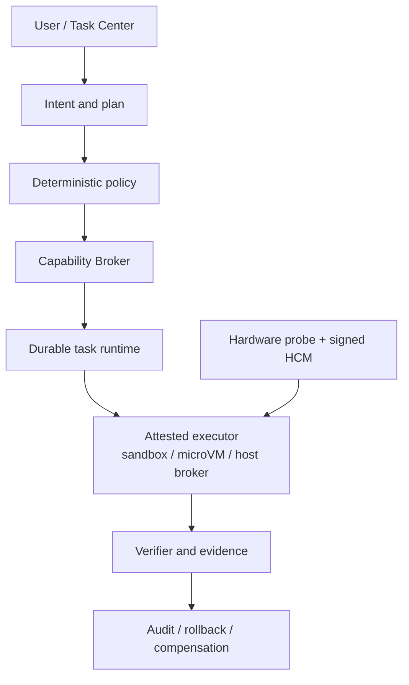
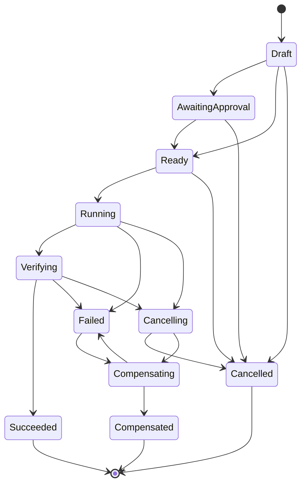

# Andromeda

[](https://github.com/oratis/Andromeda/actions/workflows/ci.yml)
[](https://github.com/oratis/Andromeda/actions/workflows/os-e2e.yml)
[](./LICENSE)
[](./rust-toolchain.toml)
[](#当前状态)

[English](./README.md) · **简体中文**

**Andromeda 是一个面向 PC 与 Mac 硬件的 AI 原生桌面操作系统项目。**

它希望保留 Windows 的游戏、Office 和文件兼容能力，吸收 macOS 的可靠性与软硬件体验，
同时把 Codex/Claude Code 式的任务执行、权限、验证和恢复能力变成 OS 的基础设施——
而不是变成又一个套在桌面上的聊天框。

核心命题只有一句：**AI 可以替用户完成任务，但模型本身永远不拥有系统权限。**
计划由模型提出，授权、状态机、执行、验证与持久化全部由确定性代码拥有。

---

## 目录

- [当前状态](#当前状态)
- [第一性目标](#第一性目标)
- [架构总览](#架构总览)
- [仓库结构](#仓库结构)
- [快速开始](#快速开始)
- [核心模型](#核心模型)
- [CLI 参考](#cli-参考)
- [HTTP API 参考](#http-api-参考)
- [持久化与并发](#持久化与并发)
- [构建可安装 OS 镜像](#构建可安装-os-镜像)
- [硬件兼容与支持等级](#硬件兼容与支持等级)
- [安全边界](#安全边界)
- [持续集成与合并门槛](#持续集成与合并门槛)
- [路线图](#路线图)
- [文档索引](#文档索引)
- [参与开发](#参与开发)
- [许可证](#许可证)

---

## 当前状态

项目已经进入首个**可安装 Daily Driver Candidate（虚拟硬件）**：

- 有基于 Fedora bootc 44 与 KDE Plasma 的 x86-64 UEFI 离线安装 ISO；
- 有从 ISO 安装到空白磁盘、移除 ISO 后首次启动的 QEMU/OVMF 自动验收；
- 有 bootc 更新到 revision 2、重启验证、回滚到 revision 1 的生命周期验收；
- 有 Flatpak/Discover、LibreOffice、Firefox、中文输入、音视频、打印/扫描、固件、
  游戏运行基础和常见文件格式支持；
- 有真实 Plasma Wayland、PipeWire、Office 格式、浏览器启动、安全暴露面和用户数据
  跨更新/回滚持久性的自动验收；
- 有可编译、可测试的 Rust workspace（工作区全局 `unsafe_code = "forbid"`）；
- 有模型不可绕过的任务、风险、能力、隔离和状态机契约；
- 有持久化任务服务、HTTP API 与开发者 CLI；
- 有 Linux、macOS、Windows 硬件探测和 Hardware Compatibility Manifest（HCM）匹配；
- 有启动时驱动诊断、HCM v2 artifact/evidence 门禁，以及 NVMe/SATA/IDE、e1000e/e1000、
  XHCI/UHCI、HDA/AC97 的虚拟硬件矩阵；
- 有跨平台 CI、产品计划和专题研究。

这个里程碑证明 Andromeda 能构建、安装、进入真实桌面、运行一组日用工作流和 AI 任务控制面，
并完成更新与回滚。

> [!IMPORTANT]
> 它**仍不是已完成认证的消费操作系统**。目前只有 QEMU/KVM x86-64 + OVMF 达到自动验收门槛，
> **没有宣称任何消费级 PC 或 Mac 已达到 Supported 或 Certified**。

### 已验证证据

**[可安装 OS 验收 #30341131852](https://github.com/oratis/Andromeda/actions/runs/30341131852)（2026-07-28）**
在全新 32 GiB 虚拟磁盘上完整通过。受测 ISO 的 SHA-256 为
`c04d8f6de780f978e261e1867283894abf2a7996b6105525660c52343ae45073`。
该记录使用 32 GiB 盘；现行 `os/scripts/test-install.sh` 已改为 64 GiB，证据快照早于此调整。

**GCP 嵌套 KVM 日用版运行（2026-07-28）**
同样在全新 32 GiB 虚拟磁盘上完成离线安装、Plasma Wayland 首启、revision 2 更新和 revision 1
回滚。受测 3.8 GiB ISO 的 SHA-256 为
`6f8d74e5f14b7dab9c478b8fd538defbdbde717dee62bbc3c7ca5c13cc597108`。
注意：该 PASS 记录早于证据提取器修复，修复只在原始串口日志上离线复验过；
**用最终版脚本一次性跑绿的完整 GCP 复跑仍在待办中。**

逐项验收结果与产物标识见
[Developer Preview 安装指南](./docs/development/installable-preview.md#已验证构建)与
[Daily Driver Candidate E2E](./docs/development/daily-driver-e2e.md#已验证运行)。

---

## 第一性目标

1. 继续运行用户已有的游戏、Office 工作流与重要文件。
2. 更新、驱动和应用失败时保持可启动、可解释、可恢复。
3. AI 能替用户完成任务，但模型本身不拥有系统权限。
4. 对广泛硬件进行探测，对通过真实测试的硬件才作支持承诺。
5. Windows/macOS 迁移是有 manifest、校验和回退的产品流程。

---

## 架构总览



当前安装镜像运行**控制面、策略评估和硬件预检**；图中的真实 executor、凭据代理和完整 OS
事务后端仍是后续安全里程碑。**任务 API 不会执行模型提出的动作。**

数据流的实现边界：

```text
Intent
  -> versioned ActionPlan          ✅ 已实现
  -> schema / risk / DAG 校验       ✅ 已实现
  -> Capability + 确定性 Policy      ✅ 已实现
  -> durable TaskRecord            ✅ 已实现
  -> attested Executor             ❌ 未实现
  -> independent Verifier          ❌ 未实现
  -> Evidence + audit + recovery   ⚠️ 数据模型已有，执行器未实现
```

### 已实现的组件

| Crate | 作用 |
|---|---|
| [`andromeda-core`](./crates/andromeda-core) | Intent、ActionPlan、L0–L3 风险、Capability、Evidence、恢复语义、任务状态机 |
| [`andromeda-policy`](./crates/andromeda-policy) | deny-first 确定性授权、能力范围、过期、隔离等级与外部副作用确认 |
| [`andromeda-runtime`](./crates/andromeda-runtime) | 原子 JSON 持久化、跨进程锁、DAG 校验、事件历史、乐观并发 |
| [`andromeda-taskd`](./crates/andromeda-taskd) | 默认仅监听 loopback 的任务 HTTP 控制面 |
| [`andromeda-cli`](./crates/andromeda-cli) | 任务创建/查看/策略评估/状态转换和硬件探测 |
| [`andromeda-hardware`](./crates/andromeda-hardware) | Linux/macOS/Windows 隐私友好探测与 HCM 评估 |

---

## 仓库结构

```text
.
├── crates/                    # Rust workspace（6 个 crate，禁用 unsafe）
│   ├── andromeda-core/        # 任务、计划、能力、风险与状态机契约
│   ├── andromeda-policy/      # deny-first 确定性授权引擎
│   ├── andromeda-runtime/     # 原子持久化、跨进程锁、TaskService
│   ├── andromeda-taskd/       # loopback-only HTTP 控制面
│   ├── andromeda-cli/         # `andromeda` 开发者 CLI
│   └── andromeda-hardware/    # 跨平台探测、驱动诊断、HCM 匹配
├── os/                        # Fedora bootc 44 + KDE Plasma 可安装镜像
│   ├── Containerfile          # bootc 基础镜像定义
│   ├── files/                 # 注入镜像的 systemd / bootc / libexec 文件
│   ├── installer/             # Kickstart、preflight、平台守卫
│   └── scripts/               # build-iso / test-install / 硬件矩阵 / GCP E2E
├── schemas/                   # hardware-compatibility-manifest.schema.json
├── examples/hcm/              # 示例 Hardware Compatibility Manifest
├── skills/                    # 仓库内工程 skill（边界、门槛、故障防线）
├── docs/                      # 研究、产品计划、开发指南、ADR、评审
└── .github/workflows/         # ci.yml（三平台）/ os-e2e.yml（安装验收）
```

---

## 快速开始

### 前置条件

- **Rust 1.85 或更新版本**（`rust-toolchain.toml` 已固定 1.85.0 + clippy + rustfmt）；
- Git；
- Linux、macOS 或 Windows（三者均在 CI 中验证）。

构建 OS 镜像另有要求，见[构建可安装 OS 镜像](#构建可安装-os-镜像)。

### 验证工作区

```bash
cargo fmt --all -- --check
```

```bash
cargo test --workspace --locked
```

```bash
cargo clippy --workspace --all-targets --locked -- -D warnings
```

### 探测当前电脑

报告不收集序列号，也不自动上传：

```bash
cargo run --locked --bin andromeda -- hardware probe
```

在一台 Apple silicon Mac 上的真实输出：

```json
{
  "schema_version": 1,
  "collected_at": "2026-08-01T13:33:09.645635Z",
  "os_family": "macos",
  "identity": {
    "manufacturer": "Apple Inc.",
    "model": "Mac16,7",
    "board": null,
    "firmware_version": null
  },
  "cpu": { "architecture": "aarch64", "model": "Apple M4 Pro", "logical_cores": 14 },
  "memory": { "bytes": 25769803776 },
  "boot": { "uefi": false, "secure_boot": null, "tpm2": null, "virtualization": true },
  "devices": [],
  "warnings": [
    "macOS does not expose Apple boot policy as a TPM/Secure Boot equivalent; HCM must verify the platform-specific boot provider.",
    "Detailed Mac device support requires an exact Asahi or Intel/T2 model manifest."
  ]
}
```

`boot` 的每个字段都是三态：`null` 表示**无法验证**（例如探测进程缺少平台所需权限），
与 `false`（已验证不存在）是不同的结论。

驱动绑定与关键设备就绪度诊断：

```bash
cargo run --locked --bin andromeda -- hardware diagnose
```

### 对示例 HCM 做本机匹配

```bash
cargo run --locked --bin andromeda -- hardware check examples/hcm/developer-x86_64-pc.json
```

同一台 Mac 对通用 x86-64 PC manifest 的真实结果——**探测成功不等于被支持**：

```json
{
  "manifest_id": "developer-x86-64-pc",
  "selector_matched": false,
  "requirements_met": false,
  "declared_tier": "community",
  "effective_tier": "blocked",
  "boot_provider": "pc_uefi_shim",
  "evidence": [
    "HCM schema version 2 is current",
    "memory 25769803776 >= required 8589934592",
    "virtualization = true"
  ],
  "missing": [
    "hardware identity did not match any manifest selector",
    "UEFI = false, expected true"
  ]
}
```

只有 selector 与 requirements **全部**满足，`effective_tier` 才等于 manifest 声明的等级；
否则一律降为 `blocked`（进程退出码 `2`）。

### 创建一个显式授权的检查任务

```bash
cargo run --locked --bin andromeda -- \
  --state-dir .andromeda/state \
  task create-inspection . --requested-by local-user
```

该命令会 canonicalize 目标目录、铸造一个只读文件 capability、创建一个 L1 inspection action、
校验 schema/风险/依赖 DAG/capability 覆盖，然后原子写入任务记录。
**它不会遍历或修改目录**——当前 runtime 不包含 tool executor。

结果（路径已简化）：

```json
{
  "plan": {
    "schema_version": 1,
    "task_id": "7979a783-3202-4c37-81e0-5504bb5f6049",
    "intent": {
      "summary": "Inspect /home/you/project",
      "requested_by": "local-user",
      "created_at": "2026-08-01T13:32:57.151433Z"
    },
    "actions": [
      {
        "id": "145a9da0-ec21-4004-b6dd-119605168b44",
        "name": "Inspect directory metadata",
        "kind": "inspect",
        "target": "/home/you/project",
        "required_capabilities": ["7b7b0aad-3e5a-485a-84f9-8b368085b430"],
        "risk": "l1_sandboxed",
        "recovery": "none"
      }
    ]
  },
  "state": "ready",
  "revision": 0,
  "capabilities": [
    {
      "id": "7b7b0aad-3e5a-485a-84f9-8b368085b430",
      "resource": { "type": "files", "root": "/home/you/project", "access": "read" },
      "issued_to": "7979a783-3202-4c37-81e0-5504bb5f6049",
      "expires_at": null,
      "single_use": false
    }
  ],
  "events": [{ "actor": "local-user", "kind": { "type": "created" } }]
}
```

### 评估策略（不执行任何动作）

```bash
cargo run --locked --bin andromeda -- \
  --state-dir .andromeda/state \
  task evaluate 7979a783-3202-4c37-81e0-5504bb5f6049
```

```json
{
  "task_id": "7979a783-3202-4c37-81e0-5504bb5f6049",
  "revision": 1,
  "decisions": {
    "145a9da0-ec21-4004-b6dd-119605168b44": {
      "effect": "allow",
      "reasons": ["risk, isolation, capability, and deny-rule checks passed"]
    }
  }
}
```

### 启动本地任务服务

```bash
RUST_LOG=info cargo run --locked --bin andromeda-taskd
```

```bash
curl http://127.0.0.1:7777/healthz
```

默认监听 `127.0.0.1:7777`，状态目录 `.andromeda/state`。
**当前 API 没有任何认证，禁止改为非 loopback 监听。**

---

## 核心模型

### 风险等级与最低隔离

模型可以把动作声明得**更危险**，但不能声明得**更安全**——`ActionKind` 决定不可降低的风险下限。

| 等级 | 定义 | 最低隔离 |
|---|---|---|
| `L0Reasoning` | 无工具、无外部数据的推理 | `None` |
| `L1Sandboxed` | 普通文件/任务操作 | `Sandbox` |
| `L2StrongIsolation` | 未知内容、解析器、可执行输入 | `MicroVm` |
| `L3ExternalSideEffect` | 网络、系统设置、外部真实副作用 | `Brokered` + 最终确认 |

### 动作类型与风险下限

| `ActionKind` | 最低风险 | `target` 语义 |
|---|---|---|
| `reason` | L0 | —— |
| `inspect` / `read_file` | L1 | 绝对路径 |
| `write_file` / `create_directory` / `delete_file` | L1 | 绝对路径 |
| `move_file` | L1 | 源路径；目标路径在 `arguments.destination`，**两端都要写权限** |
| `parse_untrusted_content` | L2 | 绝对路径 |
| `network_request` | L3 | `host` 或 `host:port` |
| `system_change` | L3 | 系统设置键 |
| `external_call` | L3 | `service:operation`（按**首个** `:` 切分） |

### 能力（Capability）

Capability 是资源范围化的权限，**独立过期，且从不存放任何密钥值**：

| 资源类型 | 覆盖范围 |
|---|---|
| `files` | `root` 前缀下的路径（经词法规范化）+ `read`/`write`/`read_write` |
| `network` | **精确** host（大小写不敏感、忽略尾点）；不覆盖子域名；`port` 为 `null` 时覆盖任意端口 |
| `system_setting` | 一个具名系统设置键 |
| `external_service` | 一个外部服务上的一个操作 |

### 确定性策略引擎

`PolicyEngine` 对每个 action 依次检查：风险下限 → 隔离是否满足 → deny 规则 → capability
是否齐备/有效/覆盖 target/绑定 subject。**任一检查失败即 `deny`**，所有失败原因都会累积进
`reasons` 供审计；仅缺 L3 最终确认时返回 `ask`；全部通过才 `allow`。

默认 `PolicySet` 拒绝写入 `/boot`、`/etc`、`/usr`、`/System`、`C:\Windows`，并要求外部副作用
必须经过确认。路径在比较前做词法规范化，`/tmp/../etc/passwd` 这类穿越无法绕过 deny root；
无法规范化的目标（相对路径、越过根的 `..`）直接拒绝。

### 任务状态机



关键不变式：

- **`Running` 不能直接跳到 `Succeeded`**——必须经过 `Verifying`；
- `Failed` 是终态，但保留唯一一条出边 `Failed → Compensating`，供恢复语义重新打开；
- 两条授权敏感的边额外做策略复检：
  - `AwaitingApproval → Ready` 要求计划完全授权，否则必须先补授 capability；
  - `Ready → Running` 用逐 action 最低隔离重跑策略引擎，任一 action 为 `deny`/`ask` 即拒绝
    （例如 capability 在 `Ready` 之后过期，会在此被挡下）。

> [!WARNING]
> **`Ready` ≠ 已授权执行。** `Ready` 只保证"在最宽松执行假设下策略会放行"，它不保证执行时刻
> 隔离足够、capability 未过期、L3 已获人工确认，也**不保证 capability 来自可信签发方**——v0
> 控制面不校验签发链，创建者可以自铸 capability。

---

## CLI 参考

全局参数：`--state-dir <PATH>`（环境变量 `ANDROMEDA_STATE_DIR`，默认 `.andromeda/state`）。

| 命令 | 作用 |
|---|---|
| `andromeda task create-inspection <PATH> [--requested-by <ACTOR>]` | 创建只读目录检查计划并显式授予其范围 |
| `andromeda task list` | 列出全部持久化任务记录 |
| `andromeda task show <TASK_ID>` | 显示单个任务记录 |
| `andromeda task evaluate <TASK_ID> [--isolation <LEVEL>] [--confirm-external]` | 只评估策略，不执行任何动作 |
| `andromeda task transition <TASK_ID> --to <STATE> --expected-revision <N> [--actor <ACTOR>]` | 带乐观并发的受检状态转换 |
| `andromeda hardware probe` | 打印隐私友好的硬件报告 |
| `andromeda hardware diagnose` | 诊断驱动绑定与支持相关的设备就绪度 |
| `andromeda hardware check <MANIFEST> [--require-tier <TIER>]` | 探测本机并评估一份 HCM JSON |

`--isolation` 的取值为 `none` / `sandbox` / `micro-vm` / `brokered`。省略时，每个 action 按
**自身声明风险**对应的最低隔离评估；显式给出时会**覆盖全部** action，主要用于整盘探查。

> [!CAUTION]
> `--isolation` 只是策略输入模拟，**不是沙箱证明**。真实执行器必须由未来的 attestation
> 接口提供不可伪造的隔离证明。

`hardware check` 的退出码：

| 退出码 | 含义 |
|---|---|
| `0` | 有效等级可用 |
| `2` | 有效等级为 `blocked` |
| `3` | 有效等级低于 `--require-tier` 给定的等级 |

---

## HTTP API 参考

`andromeda-taskd` 参数：`--listen`（`ANDROMEDA_LISTEN`，默认 `127.0.0.1:7777`）、
`--state-dir`（`ANDROMEDA_STATE_DIR`，默认 `.andromeda/state`）。

| 方法 | 路径 | 作用 |
|---|---|---|
| `GET` | `/healthz` | 服务状态与 API 版本 |
| `POST` | `/v1/tasks` | 校验并创建任务 |
| `GET` | `/v1/tasks` | 列出任务，响应为 `{"tasks": [...], "warnings": [...]}`；损坏的记录文件被跳过并记入 `warnings`，不会让整个列表失败 |
| `GET` | `/v1/tasks/{id}` | 读取任务 |
| `POST` | `/v1/tasks/{id}/capabilities` | 给已存在任务补授权；每个新 capability 必须 `issued_to == plan.task_id` 且当前有效；带 `expected_revision` |
| `POST` | `/v1/tasks/{id}/evaluate` | 评估、不执行；**逐 action** 解析隔离等级，结果作为 `evaluated` 事件追加并使 revision +1 |
| `POST` | `/v1/tasks/{id}/transition` | 带 revision 的状态转换；`Ready`/`Running` 两条边受策略门控 |

错误响应统一为 `{"error": <code>, "message": <text>}`：

| HTTP | `error` | 触发条件 |
|---|---|---|
| 400 | `bad_request` | task id 不是合法 UUID 等 |
| 403 | `forbidden_host` | `Host` 不是 loopback |
| 404 | `not_found` | 任务不存在 |
| 409 | `already_exists` | 重复的 `task_id` |
| 409 | `revision_conflict` | `expected_revision` 过期 |
| 422 | `invalid_task` | 计划校验失败、非法状态转换、或被策略门控拒绝 |
| 500 | `internal_error` | 序列化或内部故障 |

请求体使用 `deny_unknown_fields`：`expiresAt` 这类 camelCase 拼写会被**拒绝**（422），
而不是被静默丢弃。所有 `TaskService` 调用都在 `tokio::task::spawn_blocking` 中执行，
阻塞的文件锁与 fsync 不会占用 async worker，`/healthz` 在锁竞争时依旧可响应。

### Host 校验（DNS rebinding 防护）

`taskd` 校验每个请求的 `Host`（HTTP/2 下回退到 `:authority`），只接受 `localhost`、
`127.0.0.1`、`[::1]`（可带端口），其余一律 403。恶意网页即使通过 DNS rebinding 把自己的域名
解析到 127.0.0.1，请求携带的仍是攻击者的 Host，会被拒绝。

> [!CAUTION]
> Host 校验**只防御浏览器发起的 DNS rebinding，不是鉴权**，也不能保护非 loopback 绑定。
> 任何非浏览器客户端都可以自带 `Host: localhost` 通过校验。若把 `ANDROMEDA_LISTEN` 改为
> 非 loopback 地址，API 会向该网络**无鉴权暴露**。此外，本地任意进程/用户经 loopback
> 亦可无鉴权访问。**禁止把 `taskd` 绑定到 loopback 之外。**

---

## 持久化与并发

- 每个 task revision 一个格式化 JSON 文件，写入后立即 **compaction**，稳态下每个 task 只留
  一个 revision 文件 + 一个 `{task_id}.latest` 指针文件；
- 读取先走 O(1) 指针，指针缺失/损坏/悬空时回退目录扫描（兼容旧 store 与崩溃窗口）；
- 独占跨进程锁（fs4）；临时文件写入 → flush → `sync_all` → 原子 rename；Unix 上额外同步目录；
- **写序保证崩溃安全**：revision 文件先于指针落盘，compaction 只在指针指向幸存者之后运行，
  绝不会出现指针悬空指向缺失文件；
- revision 乐观并发；每次状态变化、补授权（`granted`）和策略评估都追加 event；
- store 打开时在独占锁内清理崩溃残留的 `.{uuid}.tmp` 孤儿文件；
- 单个计划最多 **10 000** 个 action；结构校验（去重/悬挂依赖/环检测）由 core 的
  `ActionPlan::validate` 单一实现负责，使用迭代式 Kahn 拓扑排序，深链计划不会爆栈。

> [!NOTE]
> compaction 会主动删除被取代的 revision 快照，因此磁盘上的 revision 文件**不是** append-only
> 历史（完整审计线索保存在最新记录内嵌的 `events` 里）。这本就不是防物理管理员篡改的
> ledger；正式 audit ledger 需要签名、哈希链、密钥轮换、隐私删除策略和独立导出。

---

## 构建可安装 OS 镜像

`os/` 把 Rust 控制面变成基于 **Fedora bootc 44 + KDE Plasma** 的 x86-64 UEFI 可安装镜像。

> [!WARNING]
> ISO 的**默认**启动项是图形化 Anaconda 安装器。**第二个启动项是给 CI 用的破坏性自动化，
> 会擦除第一块安装盘，绝不能在有数据的机器上选择。**
> 用 `INSTALLER_DEFAULT=1` 构建会反转 GRUB 默认项，产物命名为 `*-ci.iso`，
> **不得作为开发者预览镜像分发**。

### 构建

在装有 Podman、允许特权容器的 x86-64 Linux 主机上：

```bash
sudo os/scripts/build-iso.sh
```

产物是 `output/Andromeda-Developer-Preview-x86_64.iso`、SHA-256 校验和，以及
`*.manifest.json`——后者绑定 ISO 校验和、payload 摘要、`pc_x86_64` 平台变体、boot provider
和硬件启用配置。安装器 preflight 会拒绝 Apple 硬件以及架构或 payload 身份不匹配的情况；
Mac 变体需要独立的受控镜像。

### 端到端验收

```bash
sudo env INSTALLER_DEFAULT=1 os/scripts/build-iso.sh
```

```bash
sudo os/scripts/test-install.sh
```

该测试用 UEFI 启动 ISO，自动安装到全新 64 GiB VirtIO 磁盘，移除 ISO，再从安装盘启动。
安装后的系统必须：

1. 有 Andromeda UEFI NVRAM 条目和标准 fallback loader；
2. SELinux enforcing，并到达 KDE 的 SDDM；
3. 启动仅 loopback 的 Andromeda 任务服务；
4. 生成硬件报告；
5. 通过 bootc 暂存并启动 revision 2；
6. 暂存回滚并再次启动 revision 1。

在基础生命周期之外，CI 系统还会进入 Plasma Wayland 会话，验证 PipeWire、Flatpak、
LibreOffice 的 DOCX/XLSX/PPTX/PDF 转换、真实 Firefox Wayland 启动，以及用户数据跨更新与
回滚的持久性。成功标志是串口标记 `ANDROMEDA_E2E_OK`。

启动还会产出 `hardware-diagnosis.json`；缺失启动关键的存储、网络、图形或 USB 控制器驱动会
直接阻断 E2E。

### 硬件矩阵与 GCP 嵌套 KVM

```bash
sudo os/scripts/test-hardware-matrix.sh
```

它以独立 overlay 启动 Q35/NVMe/e1000e/XHCI、Q35/SATA/e1000e、i440fx/IDE/e1000/UHCI 三组配置。
这验证的是**模拟控制器路径**；物理硬件仍由精确机型的 HCM 证据把关。

在一次性的 GCE N2（嵌套 KVM）主机上：

```bash
sudo env ANDROMEDA_SOURCE_REVISION="$(git rev-parse HEAD)" os/scripts/test-gcp-nested.sh "$PWD" "$PWD/output"
```

GCP 开机、证据回收和**保证删除实例**由仓库内的 `os/scripts/gcp-run-e2e.sh` 负责：它只创建一个
带标签的实例，设置 `--max-run-duration`，并在 EXIT trap 中删除。详见
[Daily Driver Candidate E2E](./docs/development/daily-driver-e2e.md)。

上游契约见 [`os/README.md`](./os/README.md)。

---

## 硬件兼容与支持等级

### 支持等级阶梯

```text
blocked  <  community  <  reference  <  supported  <  certified
```

`reference` 位于 `supported` 之下，因为它只有**虚拟（L0–L2）证据**；`supported`/`certified`
要求**物理整机认证**。

### 当前产品状态

| 类别 | 当前产品状态 |
|---|---|
| QEMU/KVM x86-64 + OVMF | Daily Driver Candidate；安装/桌面/更新/回滚自动验收 |
| QEMU NVMe/SATA/IDE + e1000e/e1000 | Phase 1 pairwise driver matrix |
| 选定 x86-64 PC | 下一阶段 Developer Preview 候选 |
| 未认证通用 PC | Community，**探测不等于支持** |
| 非 T2 Intel Mac | 逐机型 Pilot |
| T2 Intel Mac | Experimental |
| M1/M2 Mac | 独立 Asahi Preview 候选 |
| M3 及更新 Apple silicon（含 M5） | Watch；必须等待对应 Asahi 机型页与安装器，不作交付承诺 |

### Hardware Compatibility Manifest

HCM 是一份声明 selector、requirements、kernel channel、artifacts 与 evidence 的 JSON 文档，
当前 schema 版本为 **2**（schema 见
[`schemas/hardware-compatibility-manifest.schema.json`](./schemas/hardware-compatibility-manifest.schema.json)，
示例见 [`examples/hcm/`](./examples/hcm/)）。未知 schema 版本在评估前就被拒绝，而不是"能反序列化就接受"。

匹配器是保守的：selector 或 requirements 任一不满足，`effective_tier` 直接降为 `blocked`，
并在 `missing` 中列出具体原因。**硬件报告本身不授予任何支持等级。**
正式产品还需要 HCM 签名与 CI evidence 验证。

详细规则见[硬件、驱动与迁移研究](./docs/research/hardware-drivers-and-migration.md)、
[硬件普适性工程](./docs/development/hardware-enablement.md)、
[HCM 开发说明](./docs/development/hardware-compatibility.md)和
[实体硬件认证测试计划](./docs/development/hardware-certification-test-plan.md)。

---

## 安全边界

### 当前成立的不变式

- 模型输出**始终**是不可信输入；不可信计划不能自己选择风险下限；
- 权限由宿主 Capability Broker/Policy 决定，不由自然语言决定；
- deny 规则优先于 capability 授权；
- capability 资源范围化、独立过期、不含密钥值；
- L2 未知内容需要强隔离决策，L3 外部副作用需要 brokered 决策和最终确认；
- 计划状态不能跳过验证直接成功；
- 任务写入使用原子替换、跨进程锁和乐观 revision 校验；
- 硬件报告不含序列号，且其本身不授予支持等级。

### 当前尚不成立的部分

- 当前 `taskd` 是非特权开发服务，无认证，默认只监听 `127.0.0.1`；
- CLI 的 `--isolation` 只用于策略模拟，不是沙箱证明；
- 当前没有真实 tool executor，不应把 API 暴露到不可信网络；
- 以下均**未实现**，任何集成都不得暗示其存在：模型调用与 planner、
  bubblewrap/SELinux/microVM executor、credential broker、外部 connector/MCP broker、
  签名 policy bundle、verifier 与 rollback/compensation executor、用户身份与远程认证、
  多租户、Task Center 图形界面。

安全问题请阅读 [SECURITY.md](./SECURITY.md)。涉及权限边界、凭据泄露、文件系统逃逸、
任务策略绕过、不安全更新/恢复、固件或破坏性硬件操作的未修复漏洞，
**请勿开公开 issue**，改走 GitHub Security Advisories。

---

## 持续集成与合并门槛

| 工作流 | 内容 |
|---|---|
| [`ci.yml`](./.github/workflows/ci.yml) | `cargo fmt --check`、`clippy -D warnings`、`cargo test --workspace --locked`、安装器平台守卫、Containerfile 层预算；并在 **ubuntu / macOS / Windows** 三平台跑测试与硬件探测 |
| [`os-e2e.yml`](./.github/workflows/os-e2e.yml) | shellcheck，随后完整执行 UEFI 安装 → 首启 → 更新 → 回滚，并上传 ISO、校验和与串口证据 |

Actions 的 pin 策略：第一方 `actions/*` 固定到 major tag；第三方 action 固定到完整 commit
SHA 并带版本注释。

本地建议在提 PR 前跑：

```bash
cargo fmt --all -- --check && cargo test --workspace --locked && cargo clippy --workspace --all-targets --locked -- -D warnings && git diff --check
```

---

## 路线图

近期工程顺序：

1. 签名 HCM、安装前预检和 QEMU/真实 PC CI；
2. bootc/OCI + OSTree 镜像、断电安全更新与恢复环境；
3. Plasma/KWin Task Center adapter 与 Capability Broker daemon；
4. 受证明的 bubblewrap/SELinux sandbox 和 microVM executor；
5. Steam/Proton 管理域、Windows Workspace、Office/格式路由；
6. Windows/macOS 迁移扫描器；
7. M1/M2 Asahi 独立 Preview。

完整阶段、SLO 和前 12 周计划见[产品开发计划](./docs/product-development-plan.md)。

---

## 文档索引

**总览**

- [文档总览](./docs/README.md)
- [PC/macOS 操作系统全景与 Andromeda 架构建议](./docs/os-landscape-and-andromeda-architecture.md)
- [产品开发计划](./docs/product-development-plan.md)

**开发**

- [开发者入门](./docs/development/getting-started.md)
- [任务控制面](./docs/development/task-control-plane.md)
- [Developer Preview 安装与验收](./docs/development/installable-preview.md)
- [Daily Driver Candidate 与 GCP E2E](./docs/development/daily-driver-e2e.md)
- [Hardware Compatibility Manifest](./docs/development/hardware-compatibility.md)
- [硬件普适性工程与自动矩阵](./docs/development/hardware-enablement.md)
- [实体硬件认证测试计划](./docs/development/hardware-certification-test-plan.md)

**研究**

- [Windows 游戏、Office 与文件格式兼容](./docs/research/windows-gaming-office-formats.md)
- [PC/Mac 硬件、驱动与迁移](./docs/research/hardware-drivers-and-migration.md)
- [可靠更新、隔离与 AI Agent](./docs/research/reliability-update-ai-agent.md)
- [桌面平台与发行工程](./docs/research/desktop-platform-and-distribution.md)
- [开源组件采用矩阵](./docs/research/open-source-adoption-matrix.md)

**决策与评审**

- [架构决策记录（ADR）](./docs/adr/)
- [工程评审](./docs/reviews/)

---

## 参与开发

请先阅读 [CONTRIBUTING.md](./CONTRIBUTING.md)。要点：

- 一个 PR 只处理一个架构关注点；
- 说明用户结果、安全边界、故障路径与验证方式；
- 每条状态转换、策略规则、解析器和兼容性判定都要有测试；
- **不得**静默扩大硬件等级或应用兼容性声明；
- 未附威胁模型与显式 maintainer 评审时，**不得**引入特权执行、loopback 之外的网络监听、
  凭据访问、固件写入、磁盘变更或外部副作用；
- 关键系统设计通过 ADR 推进（模板见 [`docs/adr/0000-template.md`](./docs/adr/0000-template.md)）；
- Rust 侧：MSRV 1.85，全工作区禁用 unsafe，公开可失败函数必须文档化错误条件。

使用 Codex/Claude Code 进行调研、开发、安装 E2E、故障诊断和发布时，可调用仓库内的
[`$andromeda-os-engineering` skill](./skills/andromeda-os-engineering/SKILL.md)。
它包含项目边界、测试与合并门槛、GCP 生命周期规则和已知故障防线，并提供只读仓库/PR 审计脚本。

---

## 许可证

[Apache License 2.0](./LICENSE)。

新依赖必须有兼容许可证和明确上游来源。固件、字体、编解码器、模型权重、专有 SDK 和数据文件
需要逐产物审查，不能沿用周边项目的假设。
