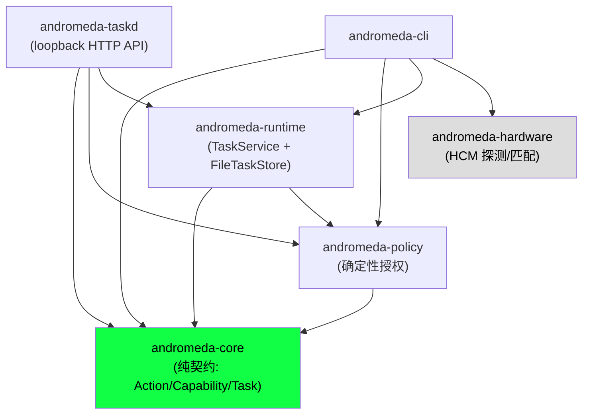

# 架构与设计评审

> 评审对象：Andromeda `main` 分支（merged HEAD）
> 范围：架构与设计（crate 分解、契约/类型设计、任务控制面、端到端一致性、演进风险）。安全、代码质量、OS 基础设施、文档由其他评审覆盖。

## 概览与总评

**总评：B（良好但有一处结构性契约缺陷）。**

核心契约层（`andromeda-core`）设计成熟：类型分离清晰、`RiskLevel → IsolationLevel` 的下限映射正确、`IsolationLevel::satisfies` 刻意用非线性矩阵而非 `Ord`，并且到处贯彻"模型输出即不可信输入"的原则。但**任务控制面之上的 API 形状与这套类型系统不自洽**：`TaskService::evaluate` 把整个 plan 压成单一 task 级 `IsolationLevel`，而 `satisfies` 是非线性的——导致同时含 L2 与 L3 动作的混合计划在一次 evaluate 里**永远无法被判为 Allow**。加上 taskd 直接把内部 struct 当 wire DTO、事件历史无界增长、CLI 与 taskd 各开各的 state store，这些都是"接一个 executor 之后再改会很贵"的契约形状问题，应在执行层落地前处理。

## 系统结构

### Crate 依赖图（已验证为无环、方向干净）



依赖方向严格自底向上，无环：`core` 是叶子（仅依赖 chrono/serde/uuid/thiserror，见 `crates/andromeda-core/Cargo.toml`）；`policy` 只依赖 `core`；`runtime` 依赖 `core`+`policy`；`taskd` 依赖三者；`cli` 是顶层消费者。`andromeda-hardware` 是**完全独立的叶子**——不依赖 `core`，与任务控制面零共享类型。工作区统一 `unsafe_code = "forbid"`、`clippy::pedantic = warn`（`Cargo.toml:36-40`）。这是本次评审中最扎实的部分。

### 数据流（v0，executor 未实现）

```text
Intent (core/task.rs:43)
  → ActionPlan{schema_version,actions[]} (core/action.rs:161)
  → validate_plan: schema/上限/去重/风险下限/DAG/subject (runtime/service.rs:298)
  → create(): plan_fully_granted? → Ready : AwaitingApproval (runtime/service.rs:134)
  → FileTaskStore: 每 revision 一个 JSON 文件 (runtime/store.rs:182)
  → evaluate(): PolicyEngine 逐 action 判定 → 追加 Evaluated 事件 (runtime/service.rs:198)
  → transition(): 状态机边 + 乐观并发 (runtime/service.rs:245)
  ⨯ Executor / Verifier / Broker  —— 全部未实现
```

两个前端，**互不连通**：`taskd`（HTTP，state 在 `/var/lib/andromeda-taskd/state`，DynamicUser）与 `andromeda-cli`（直接 in-process 打开 `FileTaskStore`，默认 `.andromeda/state`，见 `cli/src/main.rs:174-182`、`:20-26`）。CLI 内**没有任何 HTTP client**，不是 taskd 的客户端。

## 优点

1. **契约层的类型纪律。** `ActionKind::minimum_risk`（`core/action.rs:105`）给每类操作设了不可下调的风险地板，模型"只能把动作声明得更危险，不能更安全"；`RiskLevel::minimum_isolation`（`core/action.rs:92`）再映射到隔离下限。职责单一、可测。

2. **`IsolationLevel::satisfies` 刻意非线性。** `core/capability.rs:164-195` 明确注释 `Brokered` 不满足 `MicroVm`（broker 是"副作用通道"而非"内存/执行隔离"），并配套穷举矩阵测试 + 声明顺序锁定测试。这是本仓库最深思熟虑的设计决策——文档甚至警告不要用 `Ord` 做安全判定。（讽刺的是，正是它上层的 evaluate API 违背了这一原则，见风险 1。）

3. **策略引擎累积所有拒绝原因。** `PolicyEngine::evaluate`（`policy/src/lib.rs:146`）不短路，把每条失败 reason 都收进 `PolicyDecision.reasons` 供审计；deny 规则先做词法路径归一化（`normalized_absolute`，`core/capability.rs:134`），`/tmp/../etc/passwd` 无法绕过 `/etc`，不可归一化路径一律拒绝（fail-closed）。

4. **存储层的崩溃安全。** `FileTaskStore.write_atomic`（`runtime/store.rs:255`）走 temp→flush→`sync_all`→原子 rename→目录 fsync，配合 fs4 跨进程独占锁与孤儿 `.tmp` 清理；`transition`/`save` 用 `expected_revision` 做乐观并发（`runtime/store.rs:156`）。

5. **明确的可演进钩子。** `ActionPlan`(v1)、`HardwareReport`(v1)、`HcmManifest`(v2) 都带 `schema_version` 且在边界拒绝未知版本（`runtime/service.rs:299`、`cli/src/main.rs:216`）。taskd 用 `/v1/` 路径前缀 + `/healthz` 里的 `api_version`。

6. **DNS rebinding 防护。** taskd 用 `Host` 头 allowlist（`taskd/src/lib.rs:51-98`），严格匹配 loopback，并有精细的边界测试。文档也诚实说明"这不是鉴权"。

## 问题与风险（按严重度排序）

### 1. 【严重】`evaluate` 用单一 task 级 isolation 评估非线性 satisfies 矩阵 → 混合风险计划不可 Allow

`TaskService::evaluate(task_id, isolation, ...)` 接收**一个**标量 `IsolationLevel`，构造**一个** `EvaluationContext`，再对 plan 里**每个** action 用同一 isolation 跑 `satisfies`（`runtime/service.rs:198-219`）。wire 契约 `EvaluationRequest{ isolation }` 同样是单标量（`taskd/src/lib.rs:24-29`）。

但 `satisfies` 是非线性的（`core/capability.rs:186`）：`L2StrongIsolation` 只被 `MicroVm` 满足，`L3ExternalSideEffect` 只被 `Brokered` 满足，而**不存在任何单一 isolation 同时满足 MicroVm 与 Brokered**（`MicroVm.satisfies(Brokered)=false`，`Brokered.satisfies(MicroVm)=false`）。

**失败场景：** 一个再自然不过的计划——"把未知下载解析进 microVM（L2 `ParseUntrustedContent`），再把结果通过 broker 外发（L3 `NetworkRequest`）"——`validate_plan` 通过、甚至能进 `Ready`，但任何一次 `evaluate`：
- `isolation=MicroVm` → L3 动作因 `MicroVm.satisfies(Brokered)=false` 被 Deny；
- `isolation=Brokered` → L2 动作因 `Brokered.satisfies(MicroVm)=false` 被 Deny。

**永远至少一个动作 Deny，整计划不可执行。** 更糟的是自相矛盾：创建时 `plan_fully_granted` 用**逐 action 的** `action.risk.minimum_isolation()` 判定（`runtime/service.rs:288-295`），所以混合计划能被标成 `Ready`；而真正 evaluate 时切回**全局单一** isolation，同一计划必然 Deny。create-time 与 evaluate-time 用了两套隔离模型。这一契约（`EvaluationRequest`）一旦被 executor 消费，回改代价极高。

**修法方向：** evaluate 应按 action（或按 DAG 分段）携带各自的执行 isolation，而非 task 级单标量；或在 `validate_plan` 阶段就基于 satisfies 矩阵拒绝"隔离需求不可共存"的混合计划，把矛盾前移到创建时暴露。

### 2. 【中等】`AwaitingApproval` 既无法补授权，又能被 transition 绕过

状态机允许 `AwaitingApproval → Ready`（`core/task.rs:103`），所以 FSM 上不是死路。但：
- **没有任何 capability 补授权入口。** capability 只在 `create` 时随 `CreateTaskRequest.capabilities` 注入（`runtime/service.rs:27-32`）；taskd 只有 create/get/list/evaluate/transition，没有"给已存在任务加授权"的端点。因 grant 不足而进入 `AwaitingApproval` 的任务，**无法再补齐导致它挂起的那些 grant**。
- **`transition` 不做策略复检。** `TaskService::transition`（`runtime/service.rs:245-273`）只校验状态机边合法性与 `expected_revision`，不重跑 `plan_fully_granted`/policy。于是本地任意进程可以直接 POST 把 `AwaitingApproval → Ready`，**跳过它所代表的"审批"**。

结果：`AwaitingApproval` 同时是"死结"（产生它的原因无法解决）与"形同虚设"（Ready 门禁不验证授权）。文档承认 `Ready ≠ 已授权执行`（`docs/development/task-control-plane.md:62`），但一旦 executor 把 `Ready` 当作"可跑"消费，这个未被守卫的边就是权限缺口。

### 3. 【中等】taskd 直接把内部 struct 当 wire DTO，且返回无界事件历史

- **无 DTO 层。** 所有 handler 直接 `serde_json::to_value(record)` 把内部 `TaskRecord`/`TaskEvent`/`EvaluationReport` 原样序列化为 wire 格式（`taskd/src/lib.rs:123-173`）。`TaskRecord` 含 `plan/state/revision/capabilities/events`（`runtime/service.rs:66-75`）。任何内部字段重命名/重构都是对外 API 的静默破坏性变更。plan 有 `schema_version`，但 **task/event/decision 这些 wire 类型没有版本信封**。
- **事件历史无界。** `TaskRecord.events: Vec<TaskEvent>` 只增不减；每次 transition/evaluate 都追加。`get_task`/`list_tasks` 返回**整条** events，无分页、无投影、无上限（`taskd/src/lib.rs:131-146`）。`Evaluated` 事件还内嵌**全部** action 的 `decisions: BTreeMap<ActionId,PolicyDecision>`（`runtime/service.rs:59-63`），反复 evaluate 会成倍堆叠。`list_tasks` 一次吐出所有任务的完整记录。

**失败场景：** 一个长寿命任务被 evaluate 上千次后，单个 `GET /v1/tasks/{id}` 响应膨胀到 MB 级；`GET /v1/tasks` 无界放大。叠加存储层（风险 4），读写都退化。

### 4. 【中等】存储模型：每 revision 一个文件、永不回收、每次 get 全目录扫描

`task_path = {task_id}.{revision:020}.json`（`runtime/store.rs:182`），每次写产生新文件且**从不删除旧 revision**；`latest_path` 对**整个目录**做 `record_paths()` 全扫描再按前缀过滤取 max（`runtime/store.rs:186-211`）。因每个 revision 文件都内嵌全量事件历史（风险 3），总存储约 O(revisions × events)≈ 状态变化数的平方，而 `get` 成本随 store 内**总文件数**线性增长。文档已把"revision 文件只增不减、需要 compaction"列为 TODO（`docs/development/task-control-plane.md:75`），但未提及事件历史在**单文件内**的二次膨胀，也未提及 `get` 的全目录扫描。

### 5. 【中等】CLI 与 taskd 是两套互不连通的前端（disjoint halves）

CLI 直接 in-process 打开 `FileTaskStore`（`cli/src/main.rs:174-182`），默认 state 在 cwd 下的 `.andromeda/state`（`:20-26`）；部署时 taskd 的 systemd unit 把 state 定在 `/var/lib/andromeda-taskd/state`，并以 `DynamicUser=yes`、`UMask=0077`、`ProtectSystem=strict` 运行（`os/files/usr/lib/systemd/system/andromeda-taskd.service:6-10`）。于是在真实 OS 上，普通用户跑 `andromeda task list` 打开的是**另一个（空的）** store，且因 DynamicUser + 0700 权限**根本读不到** taskd 的 store。CLI 不经过 taskd API，而是绕过 taskd 直接操作 runtime 库——两者对同一份"任务真相"各执一份，状态不共享。此外 `andromeda-hardware` 与任务面零类型共享，hardware-report 又写到第三个目录 `/var/lib/andromeda`（`os/files/usr/libexec/andromeda-hardware-report:4`），没有任何数据回流进 capability/policy 模型。当前的"一个系统"实质是"共用一个 CLI 二进制与序列化约定的两三个子系统"。

### 6. 【中等】没有结构性机制强制"执行前必须重新授权"

`create` 用创建时刻 `now` 判定 `Ready`（`runtime/service.rs:136`），但 capability 的 `expires_at`/`is_active_at`（`core/capability.rs:102`）可能在到达 `Running` 前就过期；而 `transition` 不复检（风险 2）。因此任务可以停在 `Ready` 却持有已过期的 grant。设计上把 evaluate 定位为"不执行的复检"，却**没有任何类型或状态机约束强制在 `Ready → Running` 边先跑 evaluate**。这是"契约形状"层面的空档：正确性完全依赖未来 executor 自觉先调用 evaluate。

### 7. 【轻微】`validate_plan`（runtime）与 `ActionPlan::validate`（core）重复，且各写一套环检测

`ActionPlan::validate`（`core/action.rs:212`）做去重 + 悬挂依赖 + 环检测（Kahn 拓扑排序）；`validate_plan`（`runtime/service.rs:298`）又独立做了去重 + 悬挂依赖 + 环检测（`has_cycle`，三色 DFS，`runtime/service.rs:359`），外加 schema/上限/风险下限/subject。runtime **从不调用** `ActionPlan::validate`，于是同一不变量（计划结构合法）有**两套实现、两套错误枚举**（`PlanValidationError` vs `ValidationError`）、**两种环检测算法**。core 公开导出的 `PlanValidationError` 实际无人消费。未来对"合法结构"的定义或环检测的任一处修正都不会自动传播到另一处，存在分叉风险。

### 8. 【轻微】`Capability.single_use` 是当前的死字段

`single_use`（`core/capability.rs:91-95`）注释说"由拥有执行状态的 runtime 层强制"；但 runtime 没有执行层，没有任何代码消费或使其失效。今天它是死字段，没有测试保护"首次成功执行后失效"这一语义。一旦接入 executor，它必须成为强制点——但契约只在注释里承诺，无机制兜底。

## 演进建议（按优先级）

1. **【先做，阻塞 executor】修复混合隔离的 evaluate 契约（风险 1）。** 二选一或并用：(a) 让 evaluate 按 action / 按 DAG 分段携带各自 isolation，`EvaluationRequest` 从单标量改为 per-action 映射；(b) 在 `validate_plan` 用 satisfies 矩阵拒绝"隔离需求不可共存"的计划，把矛盾前移到创建期。务必让 create-time（`plan_fully_granted` 的逐 action 隔离）与 evaluate-time 用**同一套**隔离模型。

2. **【executor 落地前】给授权/审批一条真实机械路径（风险 2、6）。** 增加"对 `AwaitingApproval` 任务追加 capability"的端点；把 `Ready → Running`（以及 `AwaitingApproval → Ready`）做成**策略门控**转换——转换时重跑 policy，过期/缺授权则拒绝。让 `Ready` 或 `Running` 边成为强制的重新授权点，而非依赖 executor 自觉。

3. **【冻结公开 API 前】引入 wire DTO 层并给事件读取加界（风险 3、4）。** 在 taskd 与内部类型间放一层显式 DTO，给 task/event 包一个版本信封；`get/list` 默认不返回完整 events（分页 + 投影 + 上限）；落地文档已承认的 revision compaction，并把"单文件内嵌全量历史"改为事件与快照分离，消除二次膨胀与全目录扫描。

4. **【中期】明确 CLI 与 taskd 的关系（风险 5）。** 要么让 CLI 成为 taskd 的 HTTP client（单一真相源），要么在文档/命令层显式区分"本地库模式"与"守护进程模式"并统一默认 state 目录约定，避免"跑了命令却看不到任务"的困惑。

5. **【清理】统一计划校验（风险 7）。** 让 runtime 复用 `ActionPlan::validate` 做结构校验（去重/悬挂/环），`validate_plan` 只叠加它独有的 schema/上限/风险/subject 检查；删掉重复的第二套环检测与并行错误枚举。

6. **【记账】给 `single_use` 等"注释即契约"的字段建挂账测试（风险 8），** 标注为"executor 落地时必须强制"，避免接入执行层时被遗漏。

---

*说明：本文所有 `file:line` 引用均基于评审时的 merged HEAD；第 1、2、3、7 项已独立复核确认为真实存在，非文档臆测。*

*Reviewed by Claude Code multi-agent review (architecture dimension).*
