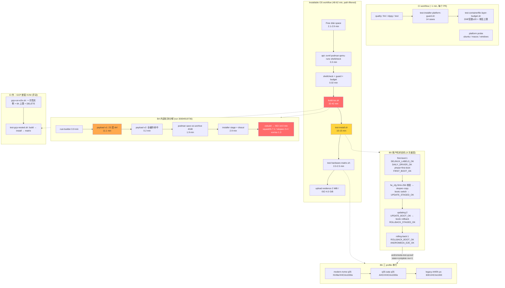

# E2E 验证流水线评审

> 评审对象：Andromeda E2E/CI 验证流水线本身（作为一个独立产品），而非被验证的业务代码。
> 基线：`main` @ `d27cefa`（Unpin fedora-bootc base image to fix pruned-digest build break）。
> 实测数据来源：`oratis/Andromeda` GitHub Actions 真实运行记录（run 30694919736 / 30692970398 / 30692833893 / 30686771448 / 30702410393）。

## 概览与总评

**评级：B（7/10）**

这条流水线的**验证深度是 A 级的**：它跑真实 OVMF 固件、真实 Anaconda、真实 bootc `switch`/`rollback`、真实 Plasma Wayland 会话，并且用 peer inode 匹配来证明 Firefox 真的连上了 compositor 而不是静默回落 Xwayland（`os/files/usr/libexec/andromeda-daily-driver-verify:311-348`）——绝大多数 OS 项目的 "E2E" 达不到这个标准。但它的**流水线工程是 C+ 级的**：单个 48–62 分钟的巨型 job，其中 32–42 分钟是每次都从零重建、且逐次几乎完全相同的镜像构建；断言大量使用裸 `test`/`grep -q`，失败时输出为空；最关键的是 **QEMU 退出码不等于安装成功**，导致一次真实的安装失败表现为一条没有任何解释的 `exit code 1`。

已完成的 os-e2e 运行中 **11 成功 / 8 失败（通过率 57.9%）**，另有 18 次被 `cancel-in-progress` 取消。核心结论：**证据采集做得好，证据消费（fail-fast、可读失败、缓存、job 切分）做得不好**——修复成本低、收益大的点集中在后者。

## 流水线全貌

### Stage 表

| # | Stage | 位置 | 证明了什么 | 实测耗时 | 失败模式 | 产出证据 |
|---|---|---|---|---|---|---|
| A1 | `quality`：fmt/clippy/test | `.github/workflows/ci.yml:20-34` | Rust 工作区可编译、无 lint、单测通过 | **~1 min**（全量 job） | 编译/测试失败，信息充分 | Actions 日志 |
| A2 | 平台守卫单测 | `ci.yml:35` → `os/scripts/test-installer-platform-guard.sh:1-121` | 14 条平台兼容矩阵（Apple 拒绝、架构/boot_provider 不匹配、非法 manifest） | <1 s | `ANDROMEDA_PLATFORM_GUARD_TEST_OK` 缺失 | stdout marker |
| A3 | 层预算守卫 | `ci.yml:36` → `os/scripts/test-containerfile-layer-budget.sh` | payload DNF 层数 ≥20；**若有 history JSON** 则单层 ≤ 阈值 | <1 s | 层数不足或单层超预算 | `ANDROMEDA_CONTAINERFILE_LAYER_BUDGET_OK` |
| A4 | 三平台探针 | `ci.yml:38-56` | `andromeda hardware probe` 在 Linux/macOS/Windows 可运行 | ~1 min（并行） | 平台特定崩溃 | Actions 日志 |
| B1 | 释放 runner 磁盘 | `os-e2e.yml:39-43` | —（前置条件） | **2.10–2.90 min** | 磁盘不足→后续构建 OOD | — |
| B2 | 安装宿主依赖 | `os-e2e.yml:45-53` | —（前置条件） | 0.21–0.36 min | apt 源抖动 | `runc --version` |
| B3 | shellcheck + A2 + A3 | `os-e2e.yml:55-59` | 全部 shell 脚本静态合规 | **0.01–0.03 min** | shellcheck 报错 | 日志 |
| B4 | 构建 payload + ISO | `os-e2e.yml:61-70` → `os/scripts/build-iso.sh:56-155` | 镜像可构建、`bootc container lint` 通过、ISO 可生成、manifest 绑定平台身份 | **31.95–42.25 min** | 基础镜像不可解析、dnf 失败、osbuild 失败 | `*.iso`(4.0 GiB)、`*.sha256`、`*.manifest.json`、`andromeda-v1-history.json`、`andromeda-v2.tar` |
| B5 | 空盘安装 + 生命周期 | `os-e2e.yml:72-73` → `os/scripts/test-install.sh` | UEFI 空盘安装 → 首次启动 → 更新 rev2 → 回滚 rev1，10 个 marker 严格有序各出现一次 | **10.40–14.65 min** | 安装失败/UEFI 找不到引导/marker 超时 | `install-serial.log`、`boot-serial.log`、`esp-tree.txt`、`ovmf-vars.txt`、`diagnostics/**` |
| B6 | 成对硬件矩阵 | `os-e2e.yml:75-76` → `os/scripts/test-hardware-matrix.sh:194-196` | 3 组模拟控制器（NVMe/SATA/IDE + XHCI/UHCI + e1000e/e1000）上桌面栈可起 | **2.04–2.46 min** | 某 profile 无 marker 或 readiness≠ready | `hardware-matrix/<scenario>/{serial.log,qemu-argv.txt,qemu-img-check.txt}` |
| B7 | 上传串口证据 | `os-e2e.yml:78-94` | — | 0.03 min | — | **2 MiB**，保留 14 天 |
| B8 | 上传 ISO | `os-e2e.yml:96-111` | — | 0.31–0.71 min | — | **4,290,657,585 B ≈ 4.0 GiB**，保留 3 天 |
| C1 | GCP 嵌套 KVM（CI 外） | `os/scripts/test-gcp-nested.sh` | 同 B4–B6，跑在 n2-standard-16 上 | ~27 min（文档记录） | 前置条件不满足即静默退出 | `gcp-evidence/**` |
| C2 | GCP 实例生命周期封装 | `os/scripts/gcp-run-e2e.sh` | 一次性实例 + `--max-run-duration 6h` + `DELETE` 兜底 | — | SSH 30×10 s 未就绪 | 同上 |

### 客户机侧验证器（B5/B6 内部）

| 验证器 | 触发 | 证明 |
|---|---|---|
| `andromeda-first-boot-labels` | `ConditionPathExists=/var/lib/andromeda/selinux-label-restore-required` | `restorecon -RF /etc /var` → `ANDROMEDA_SELINUX_LABELS_OK` |
| `andromeda-hardware-report` | `Before=andromeda-ci-verify.service` | `hardware probe`+`diagnose` → `ANDROMEDA_HARDWARE_REPORT_OK readiness=… scenario=…`（scenario 来自 fw_cfg） |
| `andromeda-daily-driver-verify` | 被 ci-verify 调用 | Plasma Wayland 会话（300 s 等待）、PipeWire 图、**30 个消费级包**、媒体桥接、系统服务、**sshd 未监听 0.0.0.0/[::]:22**、≥5 GiB 余量、用户数据 SHA-256 固定值；first-boot 额外做 LibreOffice DOCX/XLSX/PPTX/PDF 转换 + Firefox Wayland 连接 |
| `andromeda-ci-verify` | `ConditionKernelCommandLine=andromeda.ci=1`，`TimeoutStartSec=20min` | 状态机 `first-boot:1 → updating:2 → rolling-back:1 → complete:1`；更新包经 **fw_cfg 传入的 SHA-256 强校验**（缺失 fw_cfg 即硬失败） |

### 流程图

### 实测耗时（三次成功运行）

| 阶段 | run 30694919736 | run 30692970398 | run 30692833893 | 占比 |
|---|---|---|---|---|
| Free disk space | 2.90 | 2.46 | 2.10 | ~5% |
| Install deps | 0.28 | 0.21 | 0.36 | <1% |
| **Validate scripts** | **0.01** | **0.03** | **0.03** | **~0%** |
| **Build payload + ISO** | **31.95** | **38.53** | **42.25** | **66–68%** |
| Install + lifecycle | 10.40 | 14.43 | 14.65 | ~22% |
| Hardware matrix | 2.04 | 2.45 | 2.46 | ~4% |
| Upload evidence + ISO | 0.49 | 0.34 | 0.74 | ~1% |
| **总计** | **48 min** | **58 min** | **62 min** | |

**构建阶段内部分解**（run 30694919736，从 job 日志时间戳精确提取）：

| 子阶段 | 耗时 |
|---|---|
| rust-builder（`cargo build --release` 32.85 s） | 0.9 min |
| **payload v1：23 个 dnf 层** | **11.1 min** |
| payload v2（`ARG IMAGE_REVISION` 位于所有 dnf 层之后 → 全缓存命中） | 0.2 min |
| `podman history` + `podman save` 4 GiB OCI archive | 1.9 min |
| installer stage（anaconda + dracut） | 2.9 min |
| **osbuild → ISO**（squashfs 7.1 / skopeo 2.4 / xorriso 1.3） | **14.0 min** |

> 关键观察：日志中 `Using cache` 出现 73 次，**全部来自单次运行内部**（v1→v2、v1→installer 复用）。**跨运行零缓存**——runner 是全新的，且 `os-e2e.yml:41-43` 的 `docker-images: true` 主动清空了预置镜像。11.1 min 的 dnf 层每次都从零重跑。

## 评估

### 1. 可诊断性 / 可观测性

**结论：证据采集 A-，失败信号 D。这是本流水线最大的落差。**

**做得好的部分（已验证诊断重排修复是正确且完整的）：**

`os/scripts/test-install.sh:176-236` 的重排是**正确的**。ESP/root 诊断收集现在位于所有 exit gate（`:240-254`）之前，且整块是 best-effort：ESP 挂载失败只打 WARNING 并把 `esp_mount` 置空（`:206-210`），不会 mask 真实失败原因；root 用 `-o ro,noload` 挂载（`:215`），避免脏 ext4 journal 导致挂载失败；EXIT trap（`:37-51`）负责在提前退出时卸载。

Payloads 模块 journal 抓取也已到位且**双路冗余**：`os/installer/collect-anaconda-diagnostics.sh:48-50` 写串口，`:65-66` 写 ESP。`program.log` 用 `max_lines=0` 全量输出（`:42-46`）。**这一项无缺陷。**

**严重缺陷 1 — QEMU 退出码不等于安装成功（假阴性 gate）：**

run **30686771448** 是决定性证据。日志显示：ESP 上存在 `EFI/Andromeda/diagnostics/{anaconda.log,program.log,journal.log,…}`——这些**只由 `%onerror` 钩子写出**（`os/installer/andromeda-ci.ks:25-27`），即**安装确实失败了**；但日志中**没有** `Installer exited with status …`，说明 `install_status == 0`——Anaconda 走 `%onerror` 后仍执行 ks 的 `shutdown`，QEMU 干净退出 0；于是 `test-install.sh:240` 的 gate 放行，脚本一路走到 `:261-263` 的 `grep … | tee`，该 grep 匹配为空 → `set -o pipefail` + `set -e` → **`exit code 1`，日志里没有任何一个字解释原因**。

当前 main 仍有此洞：`test-install.sh:261-264` 只检查正向 marker，**从不检查 `ANDROMEDA_INSTALLER_DIAGNOSTICS_START` 或 `ANDROMEDA_INSTALLER_PREFLIGHT_FAILED` 是否出现**。

**严重缺陷 2 — 静默断言遍布关键路径：**

以下断言在 `set -e` 下失败时输出为空，CI 只显示 `exit code 1`：`test-install.sh:64-66,146,258-259,264,266-269`、`test-hardware-matrix.sh:22-24,177-180`、`test-gcp-nested.sh:41-47`。其中 `test-gcp-nested.sh:41-47` 尤其糟糕：这是最贵的路径（GCP 实例已创建、已计费），却用 7 条裸 `test` 判定，操作者只能拿到一个退出码。

**证据体量对比**：成功运行的 serial evidence 是 **2 MiB**，失败运行 30686771448 只有 **<1 MiB**——失败路径的证据反而更薄。

### 2. 确定性 / 抗抖动

| 维度 | 状态 | 证据 |
|---|---|---|
| KVM-vs-TCG | **已修复** | `test-install.sh:82-97` / `test-hardware-matrix.sh:34-53` 现在硬性要求 `/dev/kvm`，`ANDROMEDA_ALLOW_TCG=1` 才降级 |
| marker CR/ANSI/NUL 剥离 | **只修了一半** ⚠️ | `test-install.sh:308-311` 与 Python 校验器 `:326-328` 都做了归一化。**但 `test-hardware-matrix.sh:153-180` 完全没有**——它直接 grep 原始串口日志，且 `:177-179` 是一条很长的精确匹配串，恰恰是最容易被 agetty 控制字符切断的形态。这正是 `daily-driver-e2e.md:170-174` 记录过的历史假阴性的同一 bug class |
| 超时预算嵌套 | **不自洽** ⚠️ | `TimeoutStartSec=20min` × 3 次启动 = 60 min > 宿主 boot deadline 2700 s = **45 min**（`test-install.sh:302`）。最坏情况 32+45+45+30 ≈ **152 min > `timeout-minutes: 150`**（`os-e2e.yml:33`）——真正的慢运行会表现为不可解释的 job 取消 |
| 固定端口 / nbd | 中风险 | `test-install.sh:289` 固定绑 `127.0.0.1:8080` 无重试；`:140-145` 扫描 `/dev/nbd{0..15}`。**自托管或 GCP 重复运行同一台机器时会碰撞** |
| 分区探测竞态 | 已处理 | `:154-166` 用 30 s 轮询 + `udevadm settle` |
| 重试 | 客户机侧到位 | `curl --retry 60`、`--retry-connrefused`、`skopeo copy --retry-times 5` |
| 并发取消 | 正确 | 两个 workflow 都用 `cancel-in-progress: true` |

### 3. 反馈延迟与成本

**排序基本正确，但有一处明显错位。** `Validate scripts`（0.01–0.03 min）确实在 32 分钟构建之前——这是对的。但：

- **shellcheck 只存在于 os-e2e（`os-e2e.yml:57`），ci.yml 里没有**。结果：一个纯 shell 语法错误要等 `Free disk space` + `apt install` ≈ **3.2 分钟**才被发现，而不是在 1 分钟的 CI job 里。
- **失败时的浪费**：run 30686771448 在 B5 失败，但 B4 的 32 分钟已经烧掉，且 `if: always()` 仍然上传了 **3622 MiB** 的 ISO。
- **重跑成本**：单体 job 意味着 B5 的任何抖动都要求重跑完整 48–62 分钟。
- **金钱成本**：仓库是 PUBLIC，标准 runner 与 artifact 对公开仓库免费 → 真实成本是**反馈延迟与并发槽位**。唯一的真实 $ 成本是 GCP 路径，而它**正确地被挡在 CI 之外**。

### 4. 覆盖度 vs 产品声明

**文档的诚实度值得称赞**：`daily-driver-e2e.md:119-126` 明确列出"不能证明"清单。

**但存在两处 marker 语义落差，文档未点明：**

1. **硬件矩阵的 `ANDROMEDA_E2E_OK` 比生命周期测试的弱得多。** `test-hardware-matrix.sh:72` 用 `test-install.sh` 遗留的 `andromeda-test.qcow2` 做 backing file——那块盘的状态是**回滚完成后的 `complete:1`**。客户机启动后 `andromeda-ci-verify:105-107` 直接命中 `complete:1` 分支立即发 `ANDROMEDA_E2E_OK`。也就是说：**矩阵证明的是"桌面栈能在 3 组模拟控制器上起来"，完全没有证明安装或更新/回滚在这些控制器上可行**。（公平地说，`daily-driver-verify` 在 `complete` 相位仍会跑全部通用检查，并非空壳，但语义确实不同。）
2. **"marker 通过"与"真实能力"的差距**：30 个包检查是 `rpm -q`——证明**已安装**，不证明**能工作**；`modinfo b43/iwl3945` 证明模块存在，不证明任何无线网卡能连上。与文档的"不能证明"清单一致，无夸大。
3. **门禁清单漂移**：`hardware-certification-test-plan.md:262` 把不存在的 `test-daily-driver.sh` 列为合并门禁。

### 5. 可复现性

| 场景 | 可行性 |
|---|---|
| Linux + KVM 开发机 | **良好**。需要 root（脚本明确报错说明原因）、podman、OVMF；非 Debian/Ubuntu 需覆盖 `OVMF_CODE`/`OVMF_VARS_TEMPLATE` |
| macOS 开发机 | **不可行**。无 `/dev/kvm`，`test-install.sh:85-94` 会 fail-fast（这是好的）。维护者主力平台恰是 darwin |
| GCP 路径 | **在仓内、可复现**，但**与 CI 不等价** ⚠️。`test-gcp-nested.sh:60-75` 不跑 shellcheck / platform-guard / layer-budget。而层预算检查在这里本该最有价值——此时 `andromeda-v1-history.json` 已存在，真实单层断言才会生效 |
| 环境自证 | **缺失**。CI 证据包没有记录 podman/qemu/OVMF/bootc 版本（GCP 路径有 `host-environment.txt`） |

### 6. 供应链 / 输入稳定性

这是**最需要一个连贯策略**的部分。`d27cefa` 修的是症状，不是病因。

| 输入 | 位置 | 当前状态 | 风险 |
|---|---|---|---|
| `quay.io/fedora/fedora-bootc:44` | `Containerfile:25` | **滚动 tag** | 不可复现；曾 pin 过但 Fedora GC 旧 digest 导致 `manifest unknown`（run 30702410393） |
| `docker.io/library/rust:1.85-bookworm` | `Containerfile:15` | `@sha256` ✅ | 低（Docker Hub 保留历史 digest） |
| `ghcr.io/osbuild/image-builder-cli` | `build-iso.sh:7` | `@sha256` | **中——同一类风险**。ghcr 的 GC 策略未验证，可能重演 |
| **dnf 包（23 事务，~300 包）** | `Containerfile:37-302` | **完全不固定，无 repo 快照** | **最高**。同一 commit 今天和明天构建出的镜像不同 |
| first-party / third-party actions | `ci.yml`、`os-e2e.yml` | major tag / 全 SHA | 合规 |
| apt 包（ovmf/qemu/podman） | `os-e2e.yml:48` | 不固定 + `ubuntu-latest` | **中**。OVMF/QEMU 漂移会静默改变固件行为，而 UEFI 引导正是被测对象 |
| `ghcr.io/oratis/andromeda:edge` | 两份 kickstart | **可变、未签名 tag，烧进每台安装机** | **最高（安全）** |
| **无 `schedule:` 触发** | `os-e2e.yml:3-20` | 只有 push/PR/dispatch | **高**。上游漂移永远由某个无关 PR 的作者撞上 |

**推荐策略（按输入分级，而非一刀切）：**

- **Tier A — digest pin + 自动刷新（顺序至关重要）**：`fedora-bootc`、`image-builder-cli`。教训不是"不要 pin"，而是"**先落地刷新自动化，再 pin**"。正确顺序：① 接入 Renovate/Dependabot digest 更新规则 → ② 重新 pin → ③ 增加 "pin 新鲜度" 检查，超过 N 天未刷新就**警告**，而不是等它被 GC 掉才炸。
- **Tier B — 快照而非 pin**：dnf。固定 300 个 NEVRA 不可维护；应让 payload 指向**带日期的 Fedora snapshot 镜像源**，使 commit X 的重建可复现，再按周推进快照日期。这同时把"上游更新导致 E2E 失败"从随机事件变成可调度、可归因的事件。
- **Tier C — 记录而非 pin**：OVMF/QEMU/podman/bootc 版本写进证据包头部。
- **Tier D — 签名**：`:edge` 必须在任何真实用户跟随之前配上签名策略。
- **横切**：加 `schedule:` 触发，把上游漂移的发现从"下一个倒霉的 PR 作者"移到定时任务。

### 7. 可维护性

**脚本蔓延与重复**（`os/scripts/` 共 7 个脚本 1078 行）：KVM 检测+TCG 降级文案、OVMF 路径默认值、QEMU 参数组装、marker 归一化（三份：bash / Python / gcp）、cleanup trap、`emit()` 双写（4 份）——均在多处重复。

**这种重复已经造成了实际损害**：CR/ANSI 剥离修复只落在 `test-install.sh`，`test-hardware-matrix.sh` 被漏掉。

**marker 分类学**：命名规范一致，共 24 个 marker。但**三套校验器严格度不同**：`test-install.sh` 是 Python "各恰好 1 次 + 单调有序"（最严）；`test-hardware-matrix.sh` 仅计数；`test-gcp-nested.sh` 仅前缀存在性（最松）。

**客户机状态机**（`andromeda-ci-verify:77-112`）设计干净：状态持久化在 `/var/lib/andromeda-ci/state`（跨更新/回滚保留），`state:revision` 联合匹配可捕获"状态对但版本错"，`*)` 分支兜底。**这是全流水线设计最好的部分之一。**

## 优化点（按 收益 × 置信度 / 成本 排序）

### P0 — 立即做（全部 S 成本，直接消除已观测到的失败）

**#1. 增加 Anaconda 失败 gate，消除"QEMU exit 0 == 安装成功"的假阴性**
- **问题**：`test-install.sh:240` 只看 QEMU 退出码。run 30686771448 中安装真实失败，QEMU 仍退出 0，CI 只显示 `exit code 1` + **零解释**。
- **改动**：在 gate 之后、断言之前插入：① 若 `INSTALL_LOG` 含 `ANDROMEDA_INSTALLER_DIAGNOSTICS_START` 或 `..._PREFLIGHT_FAILED` → 打印明确信息 + 日志段后失败；② 强制要求 `ANDROMEDA_INSTALLER_EFI_OK` 存在。
- **收益**：把一次需要下载 artifact 才能定位的失败，变成日志首屏一行结论。消除整类假阴性。**成本 S**

**#2. 给所有裸断言加消息（引入 `assert`/`require` 辅助函数）**
- 20+ 处裸 `test`/`grep -q` 失败时输出为空；`test-gcp-nested.sh:41-47` 最糟（GCP 已计费，7 条前置条件全静默）。新增 `os/scripts/lib/assert.sh`，三个脚本统一 source。**成本 S**

**#3. 把 CR/ANSI/NUL 剥离补进 `test-hardware-matrix.sh`** ← *性价比最高的单点修复*
- 修复只落了一半，matrix 轮询仍 grep 原始日志，且是最易被切断的长精确匹配串。消除一个潜伏的 600 s × 3 假超时抖动源。**成本 S**

**#4. 让超时预算逐层嵌套自洽**
- 建立不变式：`单元超时 < 单次启动预算`、`Σ单次启动预算 < 宿主 deadline`、`Σ阶段超时 + 构建 < job 超时`。具体：`TimeoutStartSec=12min`（3×12=36 < 45 ✅），job 超时提到 180 min。**成本 S**

**#5. 增加 `schedule:` 定时触发**
- fedora-bootc `manifest unknown` 正是被一个无关 PR 撞上的。加 `cron` 把上游漂移的发现变成定时任务先报警。这是 #8 供应链策略的前置基础设施。**成本 S**

### P1 — 主要耗时收益（M 成本）

**#6. 跨运行缓存 payload 镜像层（内容寻址）**
- 实测 **11.1 分钟**用于 23 个 dnf 层，**每次运行都从零重跑**（跨运行零缓存，且 `docker-images: true` 主动保证冷存储）。加 installer stage 2.9 分钟，共约 14 分钟纯重复工作。
- 对 `Containerfile` + `os/files/**` + `crates/**` + `Cargo.lock` 计算内容哈希，推/拉 `ghcr.io/oratis/andromeda-payload-cache:<hash>`。
- **收益**：构建 **32 → ~18 分钟**，整 job **48 → ~34 分钟（-29%）**。
- **副作用（正面）**：内容哈希缓存等于把包集合固定在同一批次，直接改善 Tier B 问题——但**必须设时间上限**（如每周强制失效），否则安全更新进不来。**成本 M**

**#7. 拆分 build 与 lifecycle 为独立 job**
- 单体 48–62 分钟 job，B5 抖动要求重跑全部。job A `build` → 上传 ISO/tar/manifest；job B `lifecycle`（`needs: build`）跑 B5+B6。
- **注意**：`test-hardware-matrix.sh:7` 消费 `test-install.sh` 产出的 qcow2，故 **B6 无法与 B5 分离**；正确切分是 `build | (lifecycle + matrix)`。
- **收益**：重跑成本 ~48 → ~13 分钟；happy path 增加约 2–4 分钟传输。**成本 M**

**#8. 供应链分级策略 + Renovate digest 刷新（先自动化，后 pin）**
- 按 Tier A/B/C/D 落地。**关键是顺序**：先接 Renovate + "pin 新鲜度"检查，**再**把 `fedora-bootc` 重新 pin 回 digest。同时验证 `image-builder-cli` 的 GC 策略——它现在是 digest pin，随时可能重演同一故障。**成本 M**

### P2 — 打磨

**#9. 把 shellcheck 移进 `ci.yml`** — 反馈 3.2 min → ~1 min，且覆盖未触碰 `os/` 的 PR。**S**
**#10. Artifact 卫生** — 4.0 GiB ISO 在失败时也上传；改 `if: success()`。`hardware-matrix/**` glob 应收窄为 `**/*.log`、`**/*.txt`（避免打包 qcow2/OVMF_VARS）。**S**
**#11. 证据自证运行环境** — B5 写 `diagnostics/host/versions.txt`，对齐 GCP 路径已有的 `host-environment.txt`。**S**
**#12. 复核 `free-disk-space` 参数** — `docker-images: true` 与 #6 缓存策略**直接冲突**，落 #6 时须一并重估。**S**
**#13. 抽取共享库消除三脚本重复** — `os/scripts/lib/{qemu,markers,assert}.sh`；**这正是 #3 那种"修复只落一半"的结构性根因**。同时统一三套校验器严格度。**M**
**#14. 并行化矩阵 3 个 profile** — KVM 下仅省 ~1.4 min，**但 TCG 下是 3 h → 1 h**。**M**
**#15. 补齐 GCP 路径与 CI 的等价性** — GCP 不跑 shellcheck/platform-guard/layer-budget，而层预算检查在那里才真正生效。**S**
**#16. 端口/nbd 冲突加固** — 改为端口 0 由内核分配后回读，或加重试。**S**
**#17. 文档口径修正** — ① 记录"硬件矩阵 `ANDROMEDA_E2E_OK` 语义弱于生命周期测试"；② 修正不存在的 `test-daily-driver.sh` 引用。**S**

## 结论

这条流水线的**验证语义设计是同类项目中的上乘之作**：fw_cfg 传 SHA-256 强校验更新载荷（缺失即硬失败、无回退）、peer inode 匹配证明 Firefox 真连上 Wayland compositor、拒绝 IPv4/IPv6/双栈通配 22 端口、marker "各恰好一次且单调有序"校验、`/var` 持久状态机捕获"状态对但版本错"——这些都不是走过场的检查。最近的诊断重排修复经核对**正确且完整**。

它的短板全部在**流水线工程**而非验证逻辑：

1. **失败信号质量与证据采集质量严重不匹配**——采集了 2 MiB 完整证据，却让开发者面对一个没有解释的 `exit code 1`。#1/#2 两个 S 级修复即可闭合。
2. **`install_status == 0` 不等于安装成功**是一个已真实发生过（run 30686771448）、且当前 main 仍存在的假阴性 gate。
3. **修复应用不一致**是结构性风险的显性表现：CR/ANSI 剥离只落到两个轮询器中的一个（#3）。根因是三脚本间的大面积复制粘贴（#13）。
4. **66–68% 的 wall-clock 花在一段逐次几乎完全相同的重建上**，而跨运行缓存与 job 切分都尚未尝试（#6/#7）。
5. **供应链缺的不是"pin 或不 pin"的选择，而是刷新自动化与定时探测**。`d27cefa` 的解绑是正确的止血，但把它当终局就错了——正确顺序是先落 Renovate + 新鲜度检查 + `schedule:`（#5/#8），再把 `fedora-bootc` 重新 pin 回去。dnf 那 ~300 个包目前完全浮动，是可复现性上最大的黑洞，应走 Fedora dated snapshot。

**建议的落地顺序**：先做 P0 五项（全部 S，主要买可诊断性与去抖动，且 #5 是 #8 的前置），再做 #6 + #7（买 29% wall-clock 与 73% 重跑成本），最后 #8 供应链分级与 #13 共享库收敛。P0 完成后，同样的失败（如 run 30686771448）应当在 CI 日志首屏就能定位，而不需要下载任何 artifact——**这是衡量这轮改进是否成功的唯一标准**。

---

*Reviewed by Claude Code multi-agent review (E2E pipeline dimension). 耗时数据来自真实 GitHub Actions 运行记录。*
